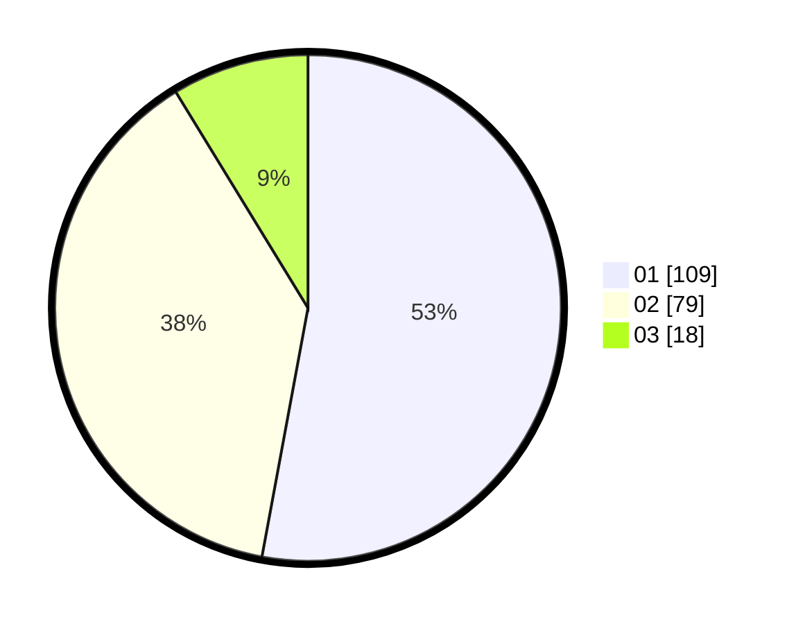

# Hasil

Hasil perolehan suara paslon dapat dilihat pada file paslon-01.txt, paslon-02.txt, dan paslon-03.txt.

Jika tidak ada, artinya data tersebut belum ada pada SIREKAP.

## Perolehan Suara

 * Paslon 01: **109**.
 * Paslon 02: **79**.
 * Paslon 03: **18**.

## Foto C Plano

https://sirekap-obj-formc.kpu.go.id/9bcf/pemilu/ppwp/31/74/09/10/05/3174091005055-20240214-223736--8e8c75ec-e087-48ae-9dd1-82bc719d7d91.jpg

https://sirekap-obj-formc.kpu.go.id/9bcf/pemilu/ppwp/31/74/09/10/05/3174091005055-20240214-210107--a53646e8-fb26-4086-a220-30101dc77129.jpg

https://sirekap-obj-formc.kpu.go.id/9bcf/pemilu/ppwp/31/74/09/10/05/3174091005055-20240214-205936--759f234f-7f4c-4cc8-ad4b-4f8804a50d6b.jpg
