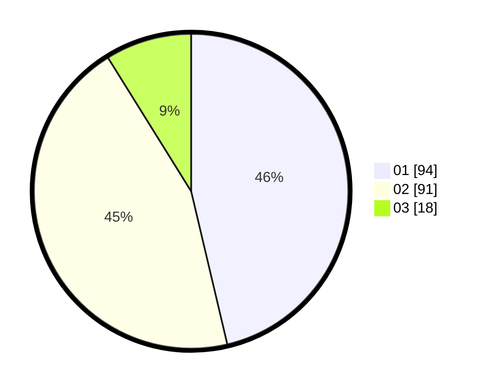

# Hasil

Hasil perolehan suara paslon dapat dilihat pada file paslon-01.txt, paslon-02.txt, dan paslon-03.txt.

Jika tidak ada, artinya data tersebut belum ada pada SIREKAP.

## Perolehan Suara

 * Paslon 01: **94**.
 * Paslon 02: **91**.
 * Paslon 03: **18**.

## Foto C Plano

https://sirekap-obj-formc.kpu.go.id/4d9e/pemilu/ppwp/31/74/09/10/05/3174091005057-20240215-021054--45f6ffdb-e64b-4e9b-9740-fa38907b4528.jpg

https://sirekap-obj-formc.kpu.go.id/4d9e/pemilu/ppwp/31/74/09/10/05/3174091005057-20240215-041005--f7985b19-d2f5-4d6e-978b-c66a2ddf7147.jpg

https://sirekap-obj-formc.kpu.go.id/4d9e/pemilu/ppwp/31/74/09/10/05/3174091005057-20240215-021408--6994cfc1-2d27-476e-b59f-8046d49f299c.jpg
