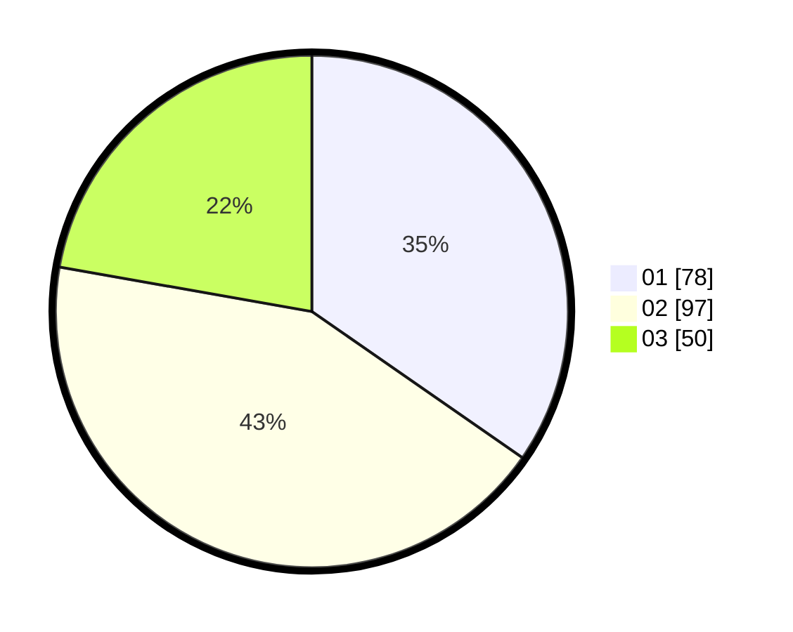

# Hasil

Hasil perolehan suara paslon dapat dilihat pada file paslon-01.txt, paslon-02.txt, dan paslon-03.txt.

Jika tidak ada, artinya data tersebut belum ada pada SIREKAP.

## Perolehan Suara

 * Paslon 01: **78**.
 * Paslon 02: **97**.
 * Paslon 03: **50**.

## Foto C Plano

https://sirekap-obj-formc.kpu.go.id/2172/pemilu/ppwp/31/74/09/10/05/3174091005073-20240214-230242--65c2419b-9e85-42b9-aa0c-0f114d7184e6.jpg

https://sirekap-obj-formc.kpu.go.id/2172/pemilu/ppwp/31/74/09/10/05/3174091005073-20240214-230126--0caf819a-30f3-4798-b864-c33475fcfd2b.jpg

https://sirekap-obj-formc.kpu.go.id/2172/pemilu/ppwp/31/74/09/10/05/3174091005073-20240214-230207--174eb68c-db62-4a75-a378-1d32d82b9060.jpg

## DATA PEMILIH TETAP

Jumlah pemilih dalam DPT: **291**.
 * L: **143**.
 * P: **148**.

## DATA PENGGUNA HAK PILIH

Jumlah pengguna hak pilih dalam DPT: **222**.
 * L: **104**.
 * P: **118**.

Jumlah pengguna hak pilih dalam DPTb: **1**.
 * L: **0**.
 * P: **1**.

Jumlah pengguna hak pilih dalam DPK: **5**.
 * L: **2**.
 * P: **3**.

Jumlah pengguna hak pilih: **228**.
 * L: **106**.
 * P: **122**.

## JUMLAH SUARA SAH DAN TIDAK SAH

JUMLAH SELURUH SUARA SAH: **225**.

JUMLAH SUARA TIDAK SAH: **3**.

JUMLAH SELURUH SUARA SAH DAN SUARA TIDAK SAH: **228**.
