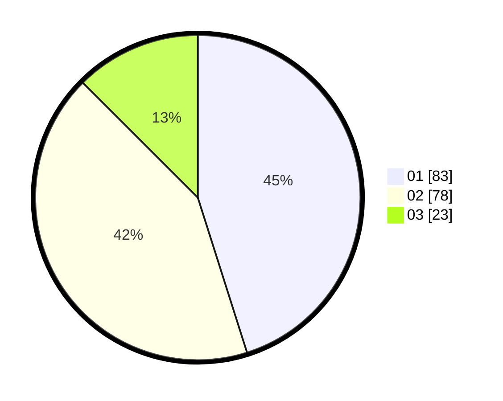

# Hasil

Hasil perolehan suara paslon dapat dilihat pada file paslon-01.txt, paslon-02.txt, dan paslon-03.txt.

Jika tidak ada, artinya data tersebut belum ada pada SIREKAP.

## Perolehan Suara

 * Paslon 01: **83**.
 * Paslon 02: **78**.
 * Paslon 03: **23**.

## Foto C Plano

https://sirekap-obj-formc.kpu.go.id/2f6b/pemilu/ppwp/31/74/09/10/05/3174091005077-20240214-202722--477583ee-3cdc-43b5-b350-bc4aeb2770b0.jpg

https://sirekap-obj-formc.kpu.go.id/2f6b/pemilu/ppwp/31/74/09/10/05/3174091005077-20240214-202702--add8731d-e6c0-4278-97ee-84d490a658b1.jpg

https://sirekap-obj-formc.kpu.go.id/2f6b/pemilu/ppwp/31/74/09/10/05/3174091005077-20240214-202738--ba68a90a-38b7-473d-a9b2-5bfc714c7b31.jpg
