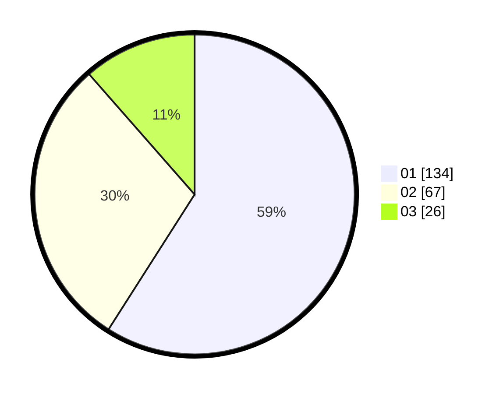

# Hasil

Hasil perolehan suara paslon dapat dilihat pada file paslon-01.txt, paslon-02.txt, dan paslon-03.txt.

Jika tidak ada, artinya data tersebut belum ada pada SIREKAP.

## Perolehan Suara

 * Paslon 01: **134**.
 * Paslon 02: **67**.
 * Paslon 03: **26**.

## Foto C Plano

https://sirekap-obj-formc.kpu.go.id/36c0/pemilu/ppwp/31/74/09/10/05/3174091005127-20240214-192044--8108c73c-11eb-4f30-9429-deb7e5fc06e5.jpg

https://sirekap-obj-formc.kpu.go.id/36c0/pemilu/ppwp/31/74/09/10/05/3174091005127-20240214-184732--65112d55-3484-40bb-aaa5-4ea9b2c88994.jpg

https://sirekap-obj-formc.kpu.go.id/36c0/pemilu/ppwp/31/74/09/10/05/3174091005127-20240214-184745--51ed4240-d351-4228-b883-0a02ae8c0075.jpg

## DATA PEMILIH TETAP

Jumlah pemilih dalam DPT: **287**.
 * L: **140**.
 * P: **147**.

## DATA PENGGUNA HAK PILIH

Jumlah pengguna hak pilih dalam DPT: **223**.
 * L: **105**.
 * P: **118**.

Jumlah pengguna hak pilih dalam DPTb: **2**.
 * L: **2**.
 * P: **0**.

Jumlah pengguna hak pilih dalam DPK: **7**.
 * L: **4**.
 * P: **3**.

Jumlah pengguna hak pilih: **232**.
 * L: **111**.
 * P: **121**.

## JUMLAH SUARA SAH DAN TIDAK SAH

JUMLAH SELURUH SUARA SAH: **227**.

JUMLAH SUARA TIDAK SAH: **5**.

JUMLAH SELURUH SUARA SAH DAN SUARA TIDAK SAH: **232**.
