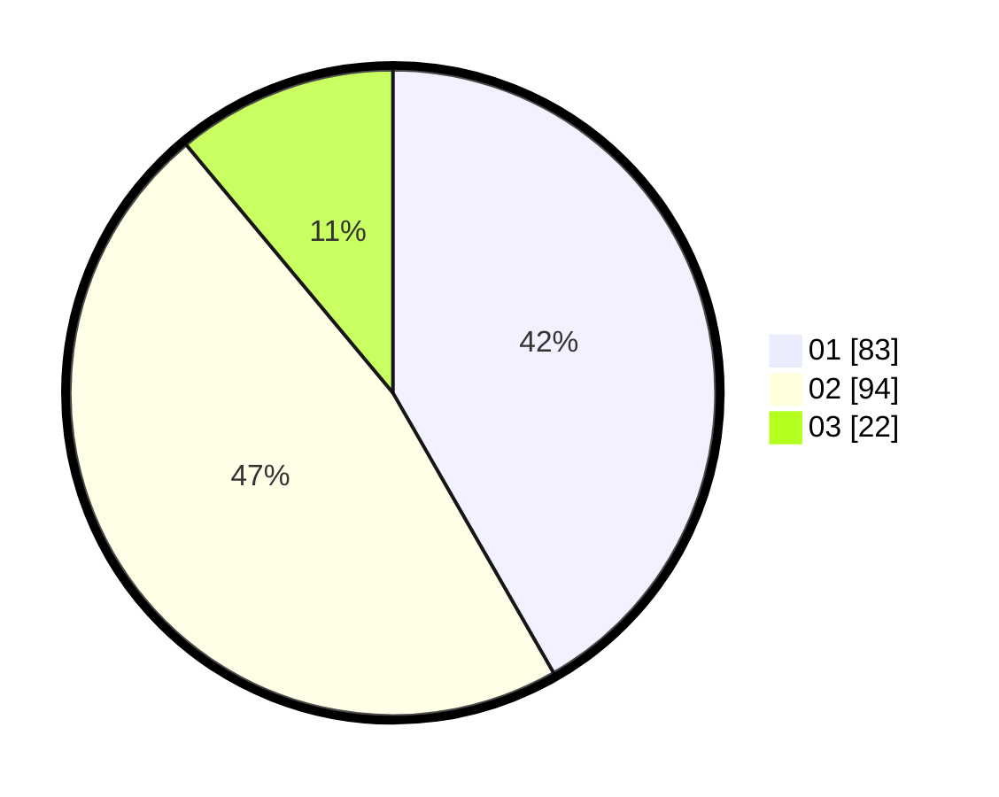

# Hasil

Hasil perolehan suara paslon dapat dilihat pada file paslon-01.txt, paslon-02.txt, dan paslon-03.txt.

Jika tidak ada, artinya data tersebut belum ada pada SIREKAP.

## Perolehan Suara

 * Paslon 01: **83**.
 * Paslon 02: **94**.
 * Paslon 03: **22**.

## Foto C Plano

https://sirekap-obj-formc.kpu.go.id/282e/pemilu/ppwp/31/74/09/10/05/3174091005136-20240214-201604--5fcd8567-1ac8-42c0-9ffe-d0e5ef56ed84.jpg

https://sirekap-obj-formc.kpu.go.id/282e/pemilu/ppwp/31/74/09/10/05/3174091005136-20240214-201741--07303098-62bd-437d-aa83-f6ff07031908.jpg

https://sirekap-obj-formc.kpu.go.id/282e/pemilu/ppwp/31/74/09/10/05/3174091005136-20240214-214526--6f217776-bbb6-49cd-b7d1-7fc14723136c.jpg

## DATA PEMILIH TETAP

Jumlah pemilih dalam DPT: **240**.
 * L: **113**.
 * P: **127**.

## DATA PENGGUNA HAK PILIH

Jumlah pengguna hak pilih dalam DPT: **189**.
 * L: **88**.
 * P: **101**.

Jumlah pengguna hak pilih dalam DPTb: **11**.
 * L: **3**.
 * P: **8**.

Jumlah pengguna hak pilih dalam DPK: **0**.
 * L: **0**.
 * P: **0**.

Jumlah pengguna hak pilih: **200**.
 * L: **91**.
 * P: **109**.

## JUMLAH SUARA SAH DAN TIDAK SAH

JUMLAH SELURUH SUARA SAH: **199**.

JUMLAH SUARA TIDAK SAH: **1**.

JUMLAH SELURUH SUARA SAH DAN SUARA TIDAK SAH: **200**.
