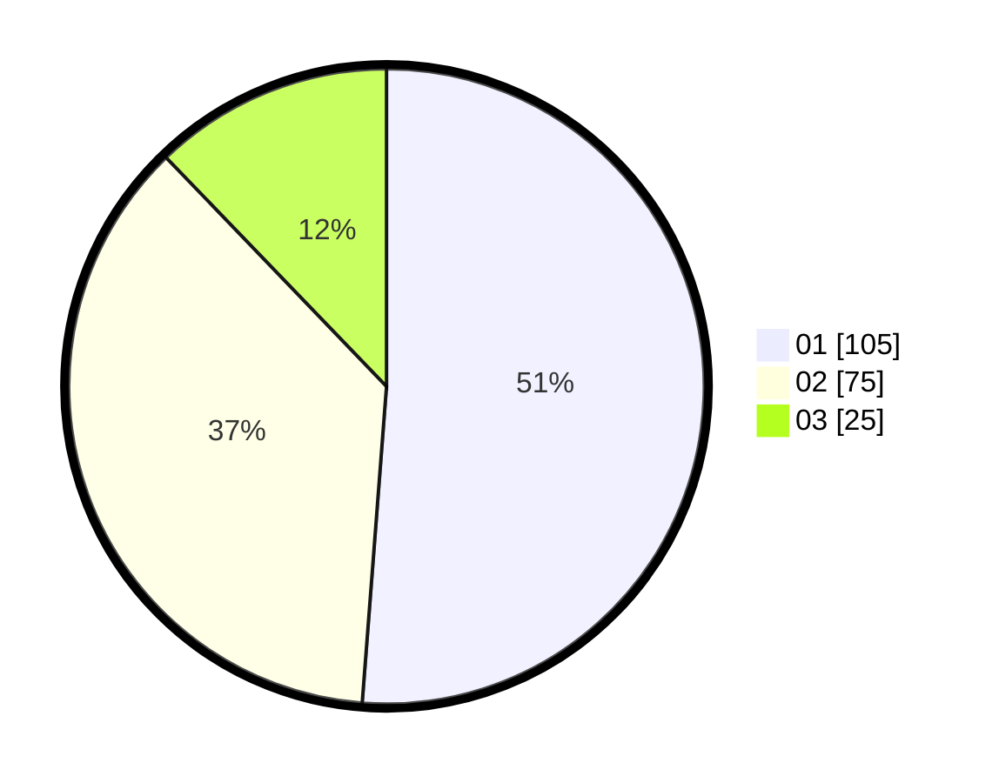

# Hasil

Hasil perolehan suara paslon dapat dilihat pada file paslon-01.txt, paslon-02.txt, dan paslon-03.txt.

Jika tidak ada, artinya data tersebut belum ada pada SIREKAP.

## Perolehan Suara

 * Paslon 01: **105**.
 * Paslon 02: **75**.
 * Paslon 03: **25**.

## Foto C Plano

https://sirekap-obj-formc.kpu.go.id/04d9/pemilu/ppwp/31/74/09/10/05/3174091005141-20240216-190445--88659e81-4ab9-49e0-98d9-6c964645b61c.jpg

https://sirekap-obj-formc.kpu.go.id/04d9/pemilu/ppwp/31/74/09/10/05/3174091005141-20240216-190447--97ee22ad-0900-49ce-a10f-79bb1577edff.jpg

https://sirekap-obj-formc.kpu.go.id/04d9/pemilu/ppwp/31/74/09/10/05/3174091005141-20240216-190446--e283954e-ff17-4735-b0a1-3a35d21e4cad.jpg

## DATA PEMILIH TETAP

Jumlah pemilih dalam DPT: **238**.
 * L: **124**.
 * P: **114**.

## DATA PENGGUNA HAK PILIH

Jumlah pengguna hak pilih dalam DPT: **204**.
 * L: **105**.
 * P: **99**.

Jumlah pengguna hak pilih dalam DPTb: **2**.
 * L: **1**.
 * P: **1**.

Jumlah pengguna hak pilih dalam DPK: **2**.
 * L: **1**.
 * P: **1**.

Jumlah pengguna hak pilih: **208**.
 * L: **107**.
 * P: **101**.

## JUMLAH SUARA SAH DAN TIDAK SAH

JUMLAH SELURUH SUARA SAH: **205**.

JUMLAH SUARA TIDAK SAH: **3**.

JUMLAH SELURUH SUARA SAH DAN SUARA TIDAK SAH: **208**.
