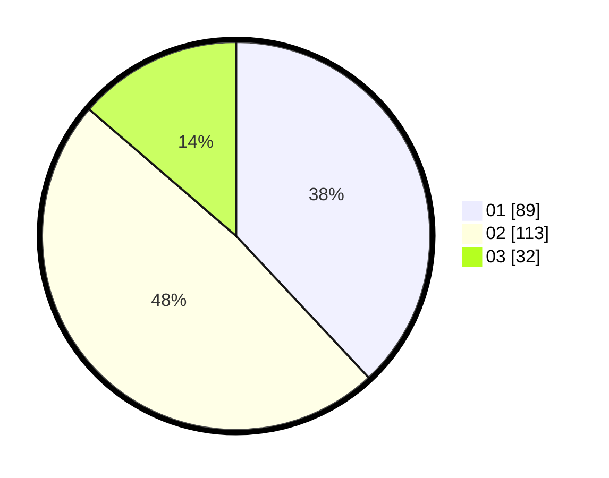

# Hasil

Hasil perolehan suara paslon dapat dilihat pada file paslon-01.txt, paslon-02.txt, dan paslon-03.txt.

Jika tidak ada, artinya data tersebut belum ada pada SIREKAP.

## Perolehan Suara

 * Paslon 01: **89**.
 * Paslon 02: **113**.
 * Paslon 03: **32**.

## Foto C Plano

https://sirekap-obj-formc.kpu.go.id/4afa/pemilu/ppwp/31/74/09/10/06/3174091006004-20240215-011610--ceadea5f-36d6-484d-8d64-a0c13bd9144d.jpg

https://sirekap-obj-formc.kpu.go.id/4afa/pemilu/ppwp/31/74/09/10/06/3174091006004-20240215-011627--ac03f443-8f91-4871-a61c-6fa96ce15b17.jpg

https://sirekap-obj-formc.kpu.go.id/4afa/pemilu/ppwp/31/74/09/10/06/3174091006004-20240215-011642--c30ef731-1e5f-4b85-89a2-75bda04a219c.jpg

## DATA PEMILIH TETAP

Jumlah pemilih dalam DPT: **267**.
 * L: **130**.
 * P: **137**.

## DATA PENGGUNA HAK PILIH

Jumlah pengguna hak pilih dalam DPT: **229**.
 * L: **109**.
 * P: **120**.

Jumlah pengguna hak pilih dalam DPTb: **1**.
 * L: **0**.
 * P: **1**.

Jumlah pengguna hak pilih dalam DPK: **11**.
 * L: **6**.
 * P: **5**.

Jumlah pengguna hak pilih: **236**.
 * L: **110**.
 * P: **126**.

## JUMLAH SUARA SAH DAN TIDAK SAH

JUMLAH SELURUH SUARA SAH: **234**.

JUMLAH SUARA TIDAK SAH: **2**.

JUMLAH SELURUH SUARA SAH DAN SUARA TIDAK SAH: **236**.
