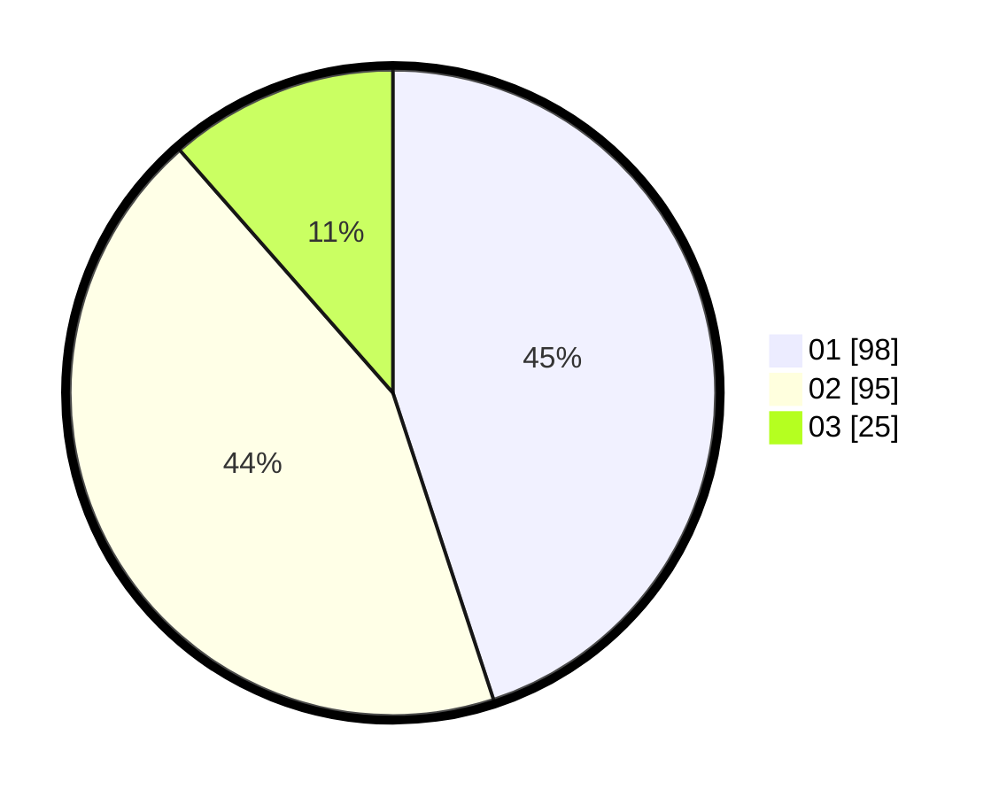

# Hasil

Hasil perolehan suara paslon dapat dilihat pada file paslon-01.txt, paslon-02.txt, dan paslon-03.txt.

Jika tidak ada, artinya data tersebut belum ada pada SIREKAP.

## Perolehan Suara

 * Paslon 01: **98**.
 * Paslon 02: **95**.
 * Paslon 03: **25**.

## Foto C Plano

https://sirekap-obj-formc.kpu.go.id/ac92/pemilu/ppwp/31/74/09/10/06/3174091006006-20240214-194819--296fd827-b5ca-4cc0-b6eb-5833847cd33e.jpg

https://sirekap-obj-formc.kpu.go.id/ac92/pemilu/ppwp/31/74/09/10/06/3174091006006-20240214-191427--5e6fb365-e92d-42fd-be3c-1b9939823b0b.jpg

https://sirekap-obj-formc.kpu.go.id/ac92/pemilu/ppwp/31/74/09/10/06/3174091006006-20240214-191953--62a95ae0-00d9-449b-9126-8950012ee6ce.jpg

## DATA PEMILIH TETAP

Jumlah pemilih dalam DPT: **266**.
 * L: **133**.
 * P: **133**.

## DATA PENGGUNA HAK PILIH

Jumlah pengguna hak pilih dalam DPT: **218**.
 * L: **106**.
 * P: **112**.

Jumlah pengguna hak pilih dalam DPTb: **0**.
 * L: **0**.
 * P: **0**.

Jumlah pengguna hak pilih dalam DPK: **3**.
 * L: **0**.
 * P: **3**.

Jumlah pengguna hak pilih: **221**.
 * L: **106**.
 * P: **115**.

## JUMLAH SUARA SAH DAN TIDAK SAH

JUMLAH SELURUH SUARA SAH: **218**.

JUMLAH SUARA TIDAK SAH: **3**.

JUMLAH SELURUH SUARA SAH DAN SUARA TIDAK SAH: **221**.
