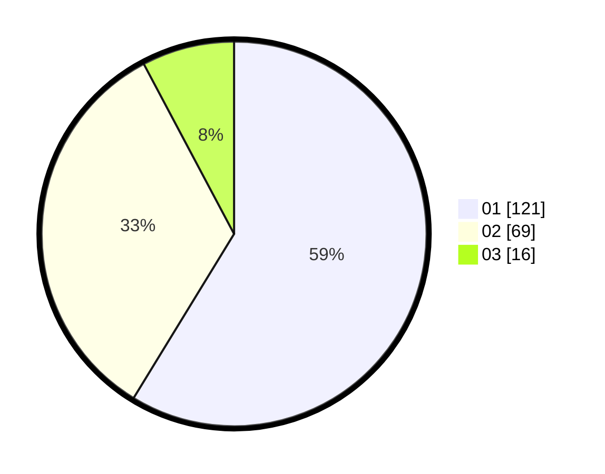

# Hasil

Hasil perolehan suara paslon dapat dilihat pada file paslon-01.txt, paslon-02.txt, dan paslon-03.txt.

Jika tidak ada, artinya data tersebut belum ada pada SIREKAP.

## Perolehan Suara

 * Paslon 01: **121**.
 * Paslon 02: **69**.
 * Paslon 03: **16**.

## Foto C Plano

https://sirekap-obj-formc.kpu.go.id/3d7c/pemilu/ppwp/31/74/09/10/06/3174091006016-20240214-155242--52c01a2a-e8b6-4863-84ec-e300bd3a5ea1.jpg

https://sirekap-obj-formc.kpu.go.id/3d7c/pemilu/ppwp/31/74/09/10/06/3174091006016-20240214-155407--a1969329-b092-4f70-831c-6a8a3f292af2.jpg

https://sirekap-obj-formc.kpu.go.id/3d7c/pemilu/ppwp/31/74/09/10/06/3174091006016-20240214-155349--ceb281ac-6250-45a0-9c2c-6b5029a492a6.jpg

## DATA PEMILIH TETAP

Jumlah pemilih dalam DPT: **239**.
 * L: **105**.
 * P: **134**.

## DATA PENGGUNA HAK PILIH

Jumlah pengguna hak pilih dalam DPT: **192**.
 * L: **75**.
 * P: **117**.

Jumlah pengguna hak pilih dalam DPTb: **14**.
 * L: **13**.
 * P: **1**.

Jumlah pengguna hak pilih dalam DPK: **1**.
 * L: **0**.
 * P: **1**.

Jumlah pengguna hak pilih: **207**.
 * L: **88**.
 * P: **119**.

## JUMLAH SUARA SAH DAN TIDAK SAH

JUMLAH SELURUH SUARA SAH: **206**.

JUMLAH SUARA TIDAK SAH: **1**.

JUMLAH SELURUH SUARA SAH DAN SUARA TIDAK SAH: **207**.
