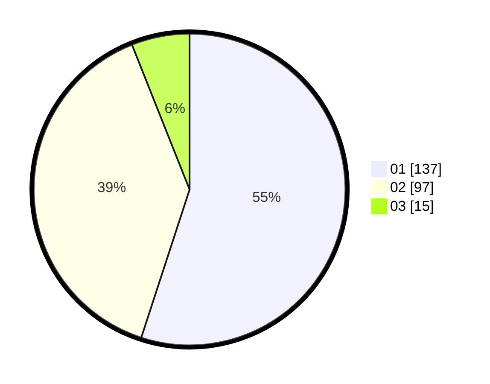

# Hasil

Hasil perolehan suara paslon dapat dilihat pada file paslon-01.txt, paslon-02.txt, dan paslon-03.txt.

Jika tidak ada, artinya data tersebut belum ada pada SIREKAP.

## Perolehan Suara

 * Paslon 01: **137**.
 * Paslon 02: **97**.
 * Paslon 03: **15**.

## Foto C Plano

https://sirekap-obj-formc.kpu.go.id/8ce4/pemilu/ppwp/31/74/09/10/06/3174091006018-20240214-190511--0f962619-d6b0-4efb-9bc3-c51ddfec69fe.jpg

https://sirekap-obj-formc.kpu.go.id/8ce4/pemilu/ppwp/31/74/09/10/06/3174091006018-20240214-190520--f77f8395-0024-4d75-87d4-4e09bea487b9.jpg

https://sirekap-obj-formc.kpu.go.id/8ce4/pemilu/ppwp/31/74/09/10/06/3174091006018-20240214-190524--2ddfa8fa-5eec-4acf-8574-2805fc7b97ab.jpg

## DATA PEMILIH TETAP

Jumlah pemilih dalam DPT: **272**.
 * L: **134**.
 * P: **138**.

## DATA PENGGUNA HAK PILIH

Jumlah pengguna hak pilih dalam DPT: **239**.
 * L: **118**.
 * P: **121**.

Jumlah pengguna hak pilih dalam DPTb: **13**.
 * L: **12**.
 * P: **1**.

Jumlah pengguna hak pilih dalam DPK: **0**.
 * L: **0**.
 * P: **0**.

Jumlah pengguna hak pilih: **252**.
 * L: **130**.
 * P: **122**.

## JUMLAH SUARA SAH DAN TIDAK SAH

JUMLAH SELURUH SUARA SAH: **249**.

JUMLAH SUARA TIDAK SAH: **3**.

JUMLAH SELURUH SUARA SAH DAN SUARA TIDAK SAH: **252**.
