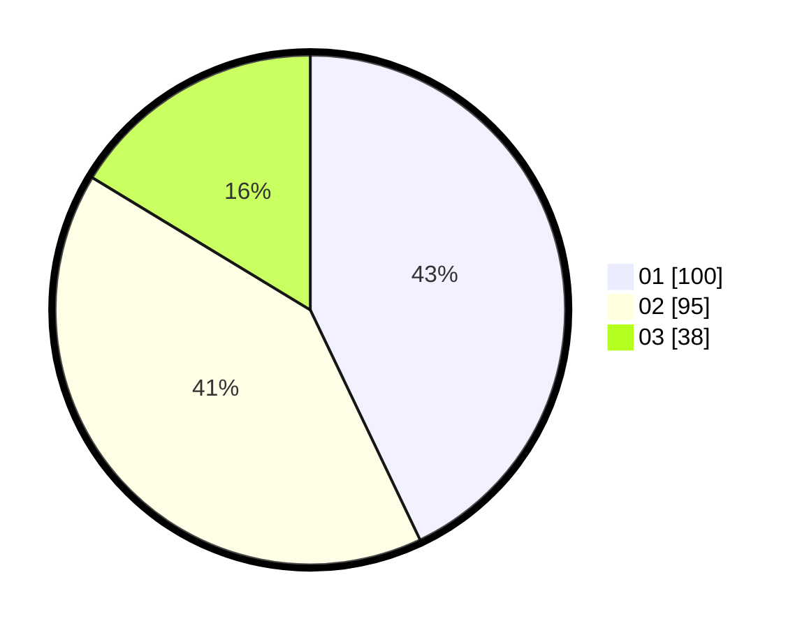

# Hasil

Hasil perolehan suara paslon dapat dilihat pada file paslon-01.txt, paslon-02.txt, dan paslon-03.txt.

Jika tidak ada, artinya data tersebut belum ada pada SIREKAP.

## Perolehan Suara

 * Paslon 01: **100**.
 * Paslon 02: **95**.
 * Paslon 03: **38**.

## Foto C Plano

https://sirekap-obj-formc.kpu.go.id/eeb5/pemilu/ppwp/31/74/09/10/06/3174091006023-20240215-000316--9d399f95-e121-4d8a-9497-f3f70ab71102.jpg

https://sirekap-obj-formc.kpu.go.id/eeb5/pemilu/ppwp/31/74/09/10/06/3174091006023-20240215-000329--32d8a936-dae8-420b-a6a1-a2bcf9924c59.jpg

https://sirekap-obj-formc.kpu.go.id/eeb5/pemilu/ppwp/31/74/09/10/06/3174091006023-20240215-000336--99571bf7-a3ba-499b-b475-e095de503d15.jpg

## DATA PEMILIH TETAP

Jumlah pemilih dalam DPT: **285**.
 * L: **136**.
 * P: **149**.

## DATA PENGGUNA HAK PILIH

Jumlah pengguna hak pilih dalam DPT: **235**.
 * L: **103**.
 * P: **132**.

Jumlah pengguna hak pilih dalam DPTb: **0**.
 * L: **0**.
 * P: **0**.

Jumlah pengguna hak pilih dalam DPK: **1**.
 * L: **1**.
 * P: **0**.

Jumlah pengguna hak pilih: **236**.
 * L: **104**.
 * P: **132**.

## JUMLAH SUARA SAH DAN TIDAK SAH

JUMLAH SELURUH SUARA SAH: **233**.

JUMLAH SUARA TIDAK SAH: **3**.

JUMLAH SELURUH SUARA SAH DAN SUARA TIDAK SAH: **236**.
