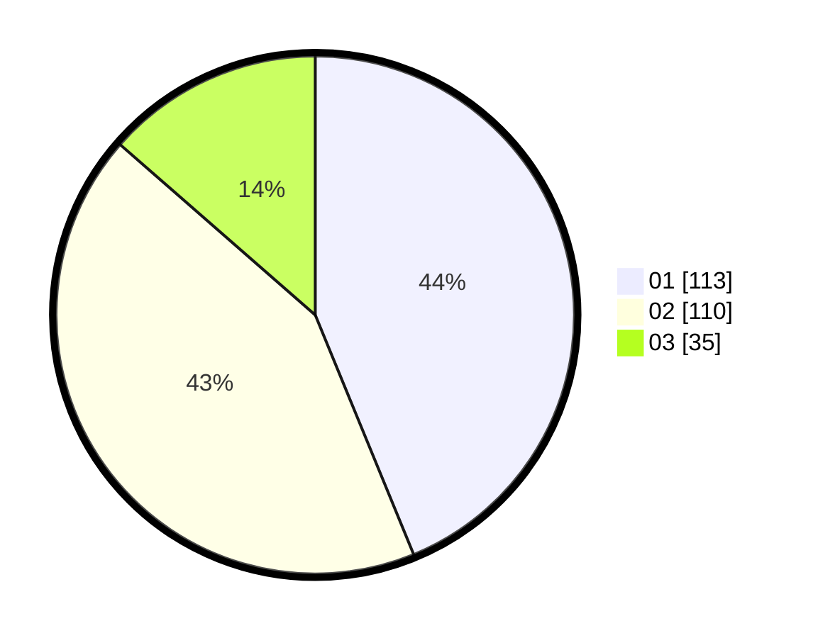

# Hasil

Hasil perolehan suara paslon dapat dilihat pada file paslon-01.txt, paslon-02.txt, dan paslon-03.txt.

Jika tidak ada, artinya data tersebut belum ada pada SIREKAP.

## Perolehan Suara

 * Paslon 01: **113**.
 * Paslon 02: **110**.
 * Paslon 03: **35**.

## Foto C Plano

https://sirekap-obj-formc.kpu.go.id/65f2/pemilu/ppwp/31/74/09/10/06/3174091006027-20240214-155853--e5c3a1af-60c1-43bb-9c6b-b6ab1761e052.jpg

https://sirekap-obj-formc.kpu.go.id/65f2/pemilu/ppwp/31/74/09/10/06/3174091006027-20240214-160100--0b9f0d1f-0912-4d98-bd97-427290e77909.jpg

https://sirekap-obj-formc.kpu.go.id/65f2/pemilu/ppwp/31/74/09/10/06/3174091006027-20240214-160054--28dfe885-c88a-4116-bbc0-38c4172e617a.jpg

## DATA PEMILIH TETAP

Jumlah pemilih dalam DPT: **300**.
 * L: **144**.
 * P: **156**.

## DATA PENGGUNA HAK PILIH

Jumlah pengguna hak pilih dalam DPT: **251**.
 * L: **116**.
 * P: **135**.

Jumlah pengguna hak pilih dalam DPTb: **7**.
 * L: **2**.
 * P: **5**.

Jumlah pengguna hak pilih dalam DPK: **1**.
 * L: **1**.
 * P: **0**.

Jumlah pengguna hak pilih: **259**.
 * L: **119**.
 * P: **140**.

## JUMLAH SUARA SAH DAN TIDAK SAH

JUMLAH SELURUH SUARA SAH: **258**.

JUMLAH SUARA TIDAK SAH: **1**.

JUMLAH SELURUH SUARA SAH DAN SUARA TIDAK SAH: **259**.
