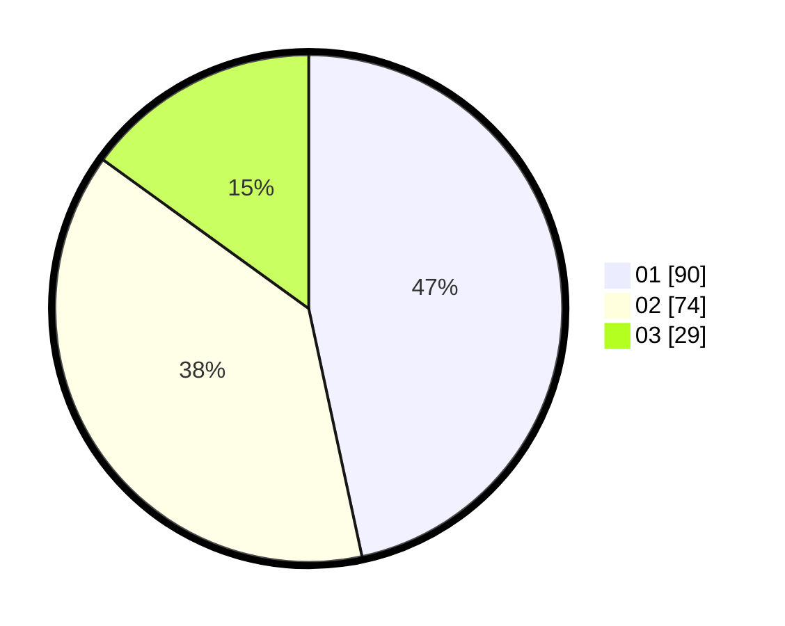

# Hasil

Hasil perolehan suara paslon dapat dilihat pada file paslon-01.txt, paslon-02.txt, dan paslon-03.txt.

Jika tidak ada, artinya data tersebut belum ada pada SIREKAP.

## Perolehan Suara

 * Paslon 01: **90**.
 * Paslon 02: **74**.
 * Paslon 03: **29**.

## Foto C Plano

https://sirekap-obj-formc.kpu.go.id/88a8/pemilu/ppwp/31/74/09/10/06/3174091006033-20240216-004544--16aee9f3-071c-4f38-bccf-9954e8eb8d38.jpg

https://sirekap-obj-formc.kpu.go.id/88a8/pemilu/ppwp/31/74/09/10/06/3174091006033-20240216-004556--accdb20f-e673-483c-aced-5ee94bd1c93a.jpg

https://sirekap-obj-formc.kpu.go.id/88a8/pemilu/ppwp/31/74/09/10/06/3174091006033-20240216-004550--0a626cc2-edc2-4fb7-96bd-a88bc7608fa9.jpg

## DATA PEMILIH TETAP

Jumlah pemilih dalam DPT: **236**.
 * L: **105**.
 * P: **131**.

## DATA PENGGUNA HAK PILIH

Jumlah pengguna hak pilih dalam DPT: **191**.
 * L: **84**.
 * P: **107**.

Jumlah pengguna hak pilih dalam DPTb: **1**.
 * L: **0**.
 * P: **1**.

Jumlah pengguna hak pilih dalam DPK: **3**.
 * L: **2**.
 * P: **1**.

Jumlah pengguna hak pilih: **195**.
 * L: **86**.
 * P: **109**.

## JUMLAH SUARA SAH DAN TIDAK SAH

JUMLAH SELURUH SUARA SAH: **193**.

JUMLAH SUARA TIDAK SAH: **2**.

JUMLAH SELURUH SUARA SAH DAN SUARA TIDAK SAH: **195**.
