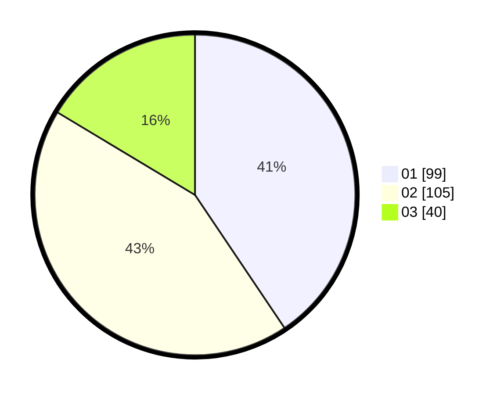

# Hasil

Hasil perolehan suara paslon dapat dilihat pada file paslon-01.txt, paslon-02.txt, dan paslon-03.txt.

Jika tidak ada, artinya data tersebut belum ada pada SIREKAP.

## Perolehan Suara

 * Paslon 01: **99**.
 * Paslon 02: **105**.
 * Paslon 03: **40**.

## Foto C Plano

https://sirekap-obj-formc.kpu.go.id/646b/pemilu/ppwp/31/74/09/10/06/3174091006041-20240214-195359--7f686a71-d30f-411d-9707-58de651c9e4c.jpg

https://sirekap-obj-formc.kpu.go.id/646b/pemilu/ppwp/31/74/09/10/06/3174091006041-20240214-195526--5edcf824-a285-43a0-b213-7e18d5822cc9.jpg

https://sirekap-obj-formc.kpu.go.id/646b/pemilu/ppwp/31/74/09/10/06/3174091006041-20240214-195605--adf0323c-a889-44a8-993d-785c6e1569b0.jpg

## DATA PEMILIH TETAP

Jumlah pemilih dalam DPT: **251**.
 * L: **126**.
 * P: **125**.

## DATA PENGGUNA HAK PILIH

Jumlah pengguna hak pilih dalam DPT: **235**.
 * L: **124**.
 * P: **111**.

Jumlah pengguna hak pilih dalam DPTb: **12**.
 * L: **0**.
 * P: **12**.

Jumlah pengguna hak pilih dalam DPK: **4**.
 * L: **2**.
 * P: **2**.

Jumlah pengguna hak pilih: **251**.
 * L: **126**.
 * P: **125**.

## JUMLAH SUARA SAH DAN TIDAK SAH

JUMLAH SELURUH SUARA SAH: **244**.

JUMLAH SUARA TIDAK SAH: **7**.

JUMLAH SELURUH SUARA SAH DAN SUARA TIDAK SAH: **251**.
