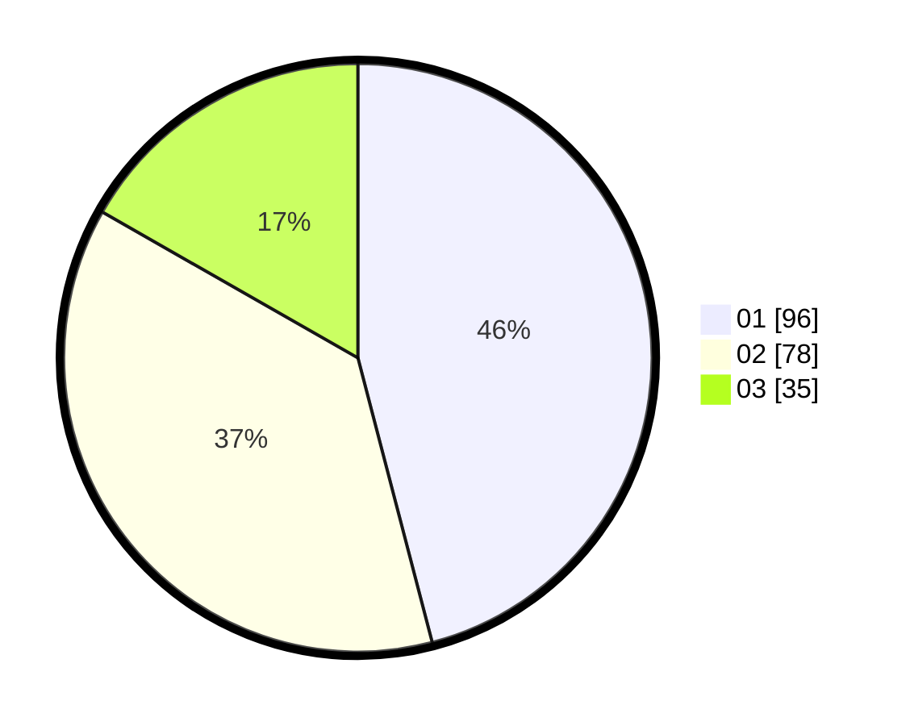

# Hasil

Hasil perolehan suara paslon dapat dilihat pada file paslon-01.txt, paslon-02.txt, dan paslon-03.txt.

Jika tidak ada, artinya data tersebut belum ada pada SIREKAP.

## Perolehan Suara

 * Paslon 01: **96**.
 * Paslon 02: **78**.
 * Paslon 03: **35**.

## Foto C Plano

https://sirekap-obj-formc.kpu.go.id/5446/pemilu/ppwp/31/74/09/10/06/3174091006044-20240215-205930--7b0a5ae5-4a13-4058-a286-022b512d39ee.jpg

https://sirekap-obj-formc.kpu.go.id/5446/pemilu/ppwp/31/74/09/10/06/3174091006044-20240215-232039--1e392e1d-2970-4c0e-9885-e7d636a5ef44.jpg

https://sirekap-obj-formc.kpu.go.id/5446/pemilu/ppwp/31/74/09/10/06/3174091006044-20240215-205935--e9e3ff14-0a33-4323-997f-5b8ef5d774d5.jpg

## DATA PEMILIH TETAP

Jumlah pemilih dalam DPT: **223**.
 * L: **109**.
 * P: **114**.

## DATA PENGGUNA HAK PILIH

Jumlah pengguna hak pilih dalam DPT: **196**.
 * L: **92**.
 * P: **104**.

Jumlah pengguna hak pilih dalam DPTb: **13**.
 * L: **5**.
 * P: **8**.

Jumlah pengguna hak pilih dalam DPK: **4**.
 * L: **1**.
 * P: **3**.

Jumlah pengguna hak pilih: **213**.
 * L: **98**.
 * P: **115**.

## JUMLAH SUARA SAH DAN TIDAK SAH

JUMLAH SELURUH SUARA SAH: **209**.

JUMLAH SUARA TIDAK SAH: **4**.

JUMLAH SELURUH SUARA SAH DAN SUARA TIDAK SAH: **213**.
