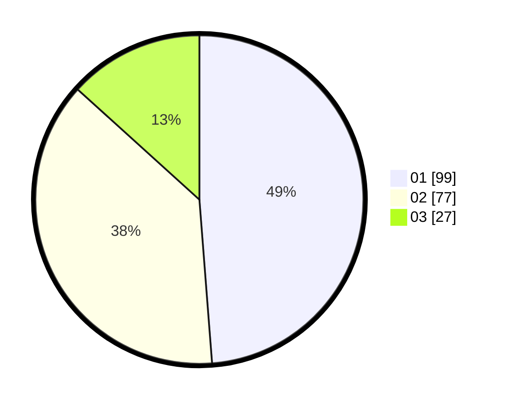

# Hasil

Hasil perolehan suara paslon dapat dilihat pada file paslon-01.txt, paslon-02.txt, dan paslon-03.txt.

Jika tidak ada, artinya data tersebut belum ada pada SIREKAP.

## Perolehan Suara

 * Paslon 01: **99**.
 * Paslon 02: **77**.
 * Paslon 03: **27**.

## Foto C Plano

https://sirekap-obj-formc.kpu.go.id/f62b/pemilu/ppwp/31/74/09/10/06/3174091006046-20240216-144733--bb76bc5d-1175-4f16-9844-132b7551639d.jpg

https://sirekap-obj-formc.kpu.go.id/f62b/pemilu/ppwp/31/74/09/10/06/3174091006046-20240216-151754--ba1bba38-47a1-4f04-9f88-a2316e3bb389.jpg

https://sirekap-obj-formc.kpu.go.id/f62b/pemilu/ppwp/31/74/09/10/06/3174091006046-20240216-181331--d0237078-a56c-44d9-80bb-c0066dc84cf8.jpg

## DATA PEMILIH TETAP

Jumlah pemilih dalam DPT: **242**.
 * L: **115**.
 * P: **127**.

## DATA PENGGUNA HAK PILIH

Jumlah pengguna hak pilih dalam DPT: **190**.
 * L: **86**.
 * P: **104**.

Jumlah pengguna hak pilih dalam DPTb: **10**.
 * L: **4**.
 * P: **6**.

Jumlah pengguna hak pilih dalam DPK: **6**.
 * L: **5**.
 * P: **1**.

Jumlah pengguna hak pilih: **206**.
 * L: **95**.
 * P: **111**.

## JUMLAH SUARA SAH DAN TIDAK SAH

JUMLAH SELURUH SUARA SAH: **203**.

JUMLAH SUARA TIDAK SAH: **3**.

JUMLAH SELURUH SUARA SAH DAN SUARA TIDAK SAH: **3**.
