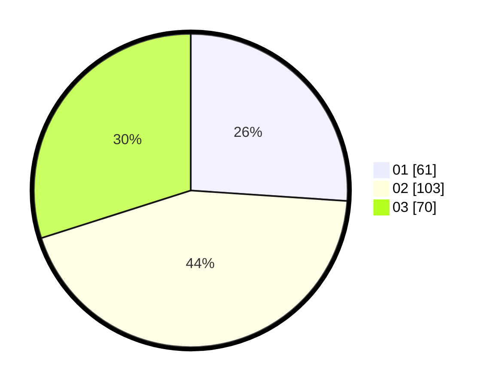

# Hasil

Hasil perolehan suara paslon dapat dilihat pada file paslon-01.txt, paslon-02.txt, dan paslon-03.txt.

Jika tidak ada, artinya data tersebut belum ada pada SIREKAP.

## Perolehan Suara

 * Paslon 01: **61**.
 * Paslon 02: **103**.
 * Paslon 03: **70**.

## Foto C Plano

https://sirekap-obj-formc.kpu.go.id/7d2e/pemilu/ppwp/31/74/09/10/06/3174091006051-20240214-185648--7f1b0077-8d85-40de-9823-c81d1f56164e.jpg

https://sirekap-obj-formc.kpu.go.id/7d2e/pemilu/ppwp/31/74/09/10/06/3174091006051-20240214-190220--e43ff965-3e87-48ae-8a1f-4ae7359a288f.jpg

https://sirekap-obj-formc.kpu.go.id/7d2e/pemilu/ppwp/31/74/09/10/06/3174091006051-20240214-190014--795f09c2-10c4-4237-95d2-75c993768367.jpg

## DATA PEMILIH TETAP

Jumlah pemilih dalam DPT: **265**.
 * L: **125**.
 * P: **140**.

## DATA PENGGUNA HAK PILIH

Jumlah pengguna hak pilih dalam DPT: **227**.
 * L: **106**.
 * P: **121**.

Jumlah pengguna hak pilih dalam DPTb: **0**.
 * L: **0**.
 * P: **0**.

Jumlah pengguna hak pilih dalam DPK: **14**.
 * L: **6**.
 * P: **8**.

Jumlah pengguna hak pilih: **241**.
 * L: **112**.
 * P: **129**.

## JUMLAH SUARA SAH DAN TIDAK SAH

JUMLAH SELURUH SUARA SAH: **234**.

JUMLAH SUARA TIDAK SAH: **8**.

JUMLAH SELURUH SUARA SAH DAN SUARA TIDAK SAH: **242**.
