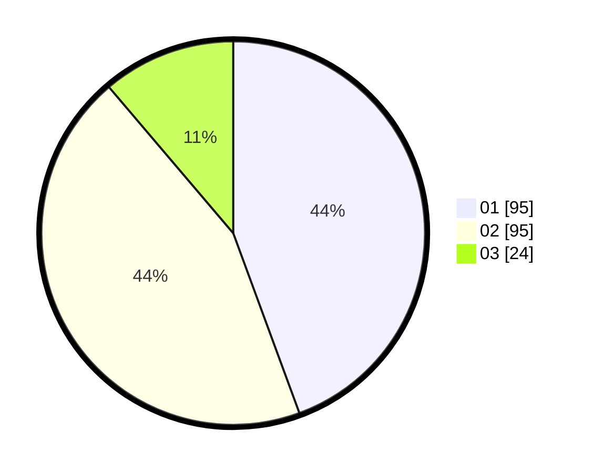

# Hasil

Hasil perolehan suara paslon dapat dilihat pada file paslon-01.txt, paslon-02.txt, dan paslon-03.txt.

Jika tidak ada, artinya data tersebut belum ada pada SIREKAP.

## Perolehan Suara

 * Paslon 01: **95**.
 * Paslon 02: **95**.
 * Paslon 03: **24**.

## Foto C Plano

https://sirekap-obj-formc.kpu.go.id/ed7f/pemilu/ppwp/31/74/09/10/06/3174091006052-20240214-224650--8e34af0c-b6cf-40cd-a9a5-47fd6d015427.jpg

https://sirekap-obj-formc.kpu.go.id/ed7f/pemilu/ppwp/31/74/09/10/06/3174091006052-20240214-224609--3003a6be-cb9e-4d48-a50c-12f732cf23fc.jpg

https://sirekap-obj-formc.kpu.go.id/ed7f/pemilu/ppwp/31/74/09/10/06/3174091006052-20240214-224858--6641d85a-7c5f-421f-90ba-ab9451446e77.jpg
