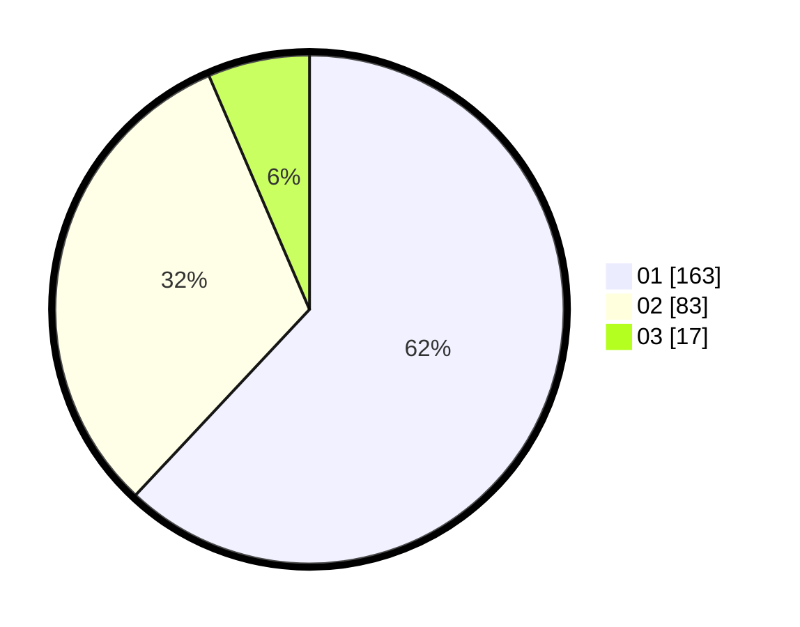

# Hasil

Hasil perolehan suara paslon dapat dilihat pada file paslon-01.txt, paslon-02.txt, dan paslon-03.txt.

Jika tidak ada, artinya data tersebut belum ada pada SIREKAP.

## Perolehan Suara

 * Paslon 01: **163**.
 * Paslon 02: **83**.
 * Paslon 03: **17**.

## Foto C Plano

https://sirekap-obj-formc.kpu.go.id/c383/pemilu/ppwp/31/74/09/10/06/3174091006071-20240214-155042--afbb88b1-5c1e-49fd-99f9-4281e7c499d0.jpg

https://sirekap-obj-formc.kpu.go.id/c383/pemilu/ppwp/31/74/09/10/06/3174091006071-20240214-155046--76967dc2-6c50-48cc-86e8-2c8525dd078f.jpg

https://sirekap-obj-formc.kpu.go.id/c383/pemilu/ppwp/31/74/09/10/06/3174091006071-20240214-155051--e5a22900-43a7-43b0-9819-4ee403af3983.jpg

## DATA PEMILIH TETAP

Jumlah pemilih dalam DPT: **281**.
 * L: **146**.
 * P: **135**.

## DATA PENGGUNA HAK PILIH

Jumlah pengguna hak pilih dalam DPT: **250**.
 * L: **132**.
 * P: **118**.

Jumlah pengguna hak pilih dalam DPTb: **12**.
 * L: **0**.
 * P: **12**.

Jumlah pengguna hak pilih dalam DPK: **2**.
 * L: **1**.
 * P: **1**.

Jumlah pengguna hak pilih: **264**.
 * L: **133**.
 * P: **131**.

## JUMLAH SUARA SAH DAN TIDAK SAH

JUMLAH SELURUH SUARA SAH: **263**.

JUMLAH SUARA TIDAK SAH: **1**.

JUMLAH SELURUH SUARA SAH DAN SUARA TIDAK SAH: **264**.
