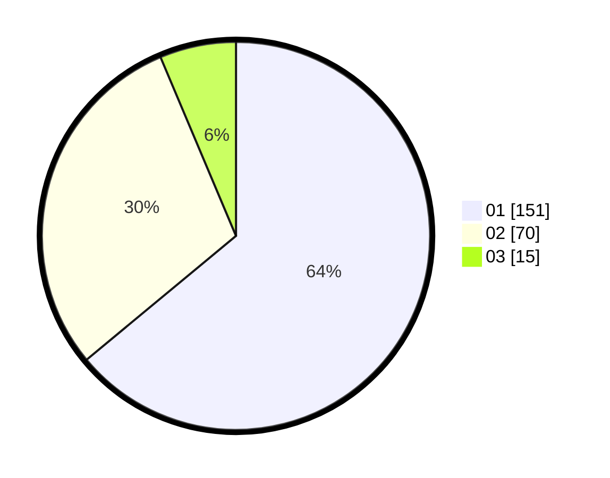

# Hasil

Hasil perolehan suara paslon dapat dilihat pada file paslon-01.txt, paslon-02.txt, dan paslon-03.txt.

Jika tidak ada, artinya data tersebut belum ada pada SIREKAP.

## Perolehan Suara

 * Paslon 01: **151**.
 * Paslon 02: **70**.
 * Paslon 03: **15**.

## Foto C Plano

https://sirekap-obj-formc.kpu.go.id/824d/pemilu/ppwp/31/74/09/10/06/3174091006074-20240214-190908--a8c0e8b9-d393-41b4-8e4b-5b58d19d72fd.jpg

https://sirekap-obj-formc.kpu.go.id/824d/pemilu/ppwp/31/74/09/10/06/3174091006074-20240214-192956--e3ab80f5-dff4-4114-b755-345c21716564.jpg

https://sirekap-obj-formc.kpu.go.id/824d/pemilu/ppwp/31/74/09/10/06/3174091006074-20240214-191207--1462b9ff-19b5-4ac3-bbb5-4a936099b2a6.jpg

## DATA PEMILIH TETAP

Jumlah pemilih dalam DPT: **266**.
 * L: **142**.
 * P: **124**.

## DATA PENGGUNA HAK PILIH

Jumlah pengguna hak pilih dalam DPT: **219**.
 * L: **115**.
 * P: **104**.

Jumlah pengguna hak pilih dalam DPTb: **17**.
 * L: **2**.
 * P: **15**.

Jumlah pengguna hak pilih dalam DPK: **2**.
 * L: **1**.
 * P: **1**.

Jumlah pengguna hak pilih: **238**.
 * L: **118**.
 * P: **120**.

## JUMLAH SUARA SAH DAN TIDAK SAH

JUMLAH SELURUH SUARA SAH: **236**.

JUMLAH SUARA TIDAK SAH: **2**.

JUMLAH SELURUH SUARA SAH DAN SUARA TIDAK SAH: **238**.
