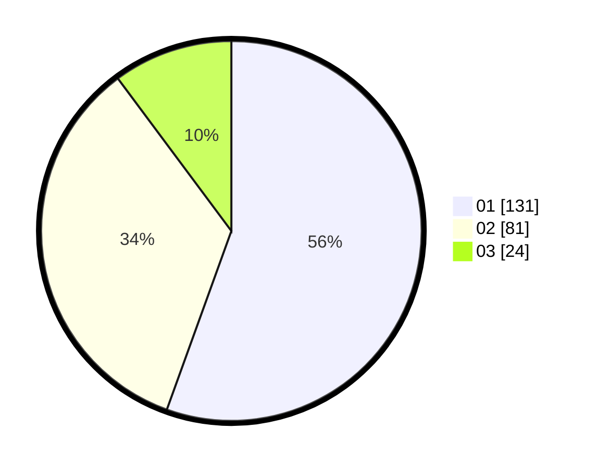

# Hasil

Hasil perolehan suara paslon dapat dilihat pada file paslon-01.txt, paslon-02.txt, dan paslon-03.txt.

Jika tidak ada, artinya data tersebut belum ada pada SIREKAP.

## Perolehan Suara

 * Paslon 01: **131**.
 * Paslon 02: **81**.
 * Paslon 03: **24**.

## Foto C Plano

https://sirekap-obj-formc.kpu.go.id/bf33/pemilu/ppwp/31/74/09/10/06/3174091006075-20240214-155758--8dca614f-4692-4960-9122-324ee5e41cb5.jpg

https://sirekap-obj-formc.kpu.go.id/bf33/pemilu/ppwp/31/74/09/10/06/3174091006075-20240214-215853--4e37ecb9-f361-4c18-a8d1-10a680cbc11c.jpg

https://sirekap-obj-formc.kpu.go.id/bf33/pemilu/ppwp/31/74/09/10/06/3174091006075-20240214-155925--6ee65597-c1b9-41be-907e-0b41804bf26b.jpg

## DATA PEMILIH TETAP

Jumlah pemilih dalam DPT: **287**.
 * L: **135**.
 * P: **152**.

## DATA PENGGUNA HAK PILIH

Jumlah pengguna hak pilih dalam DPT: **231**.
 * L: **102**.
 * P: **129**.

Jumlah pengguna hak pilih dalam DPTb: **7**.
 * L: **0**.
 * P: **7**.

Jumlah pengguna hak pilih dalam DPK: **1**.
 * L: **1**.
 * P: **0**.

Jumlah pengguna hak pilih: **239**.
 * L: **103**.
 * P: **136**.

## JUMLAH SUARA SAH DAN TIDAK SAH

JUMLAH SELURUH SUARA SAH: **236**.

JUMLAH SUARA TIDAK SAH: **3**.

JUMLAH SELURUH SUARA SAH DAN SUARA TIDAK SAH: **239**.
