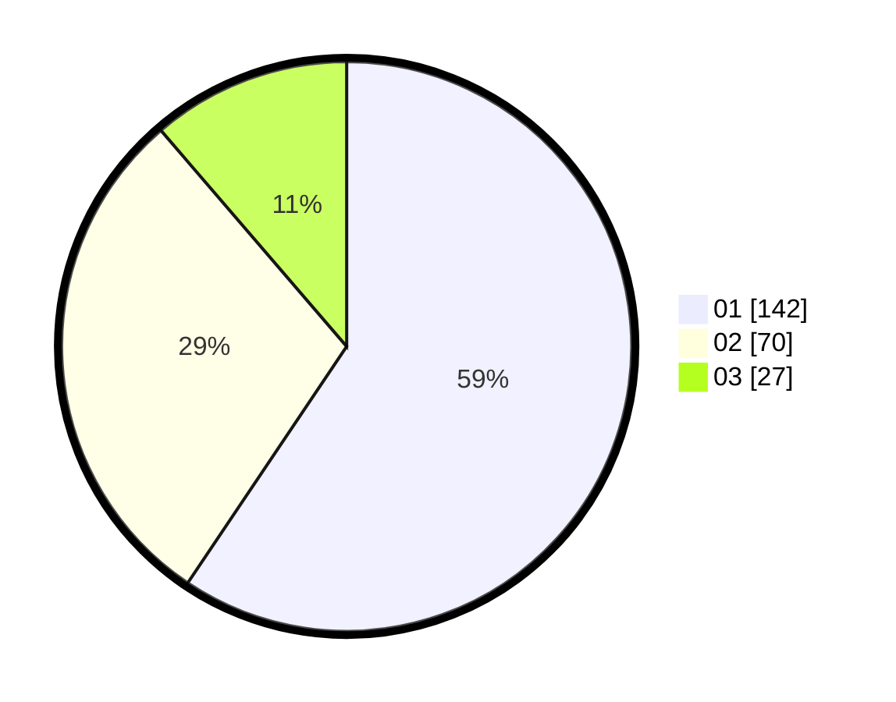

# Hasil

Hasil perolehan suara paslon dapat dilihat pada file paslon-01.txt, paslon-02.txt, dan paslon-03.txt.

Jika tidak ada, artinya data tersebut belum ada pada SIREKAP.

## Perolehan Suara

 * Paslon 01: **142**.
 * Paslon 02: **70**.
 * Paslon 03: **27**.

## Foto C Plano

https://sirekap-obj-formc.kpu.go.id/5ea5/pemilu/ppwp/31/74/09/10/06/3174091006077-20240216-013634--7df6fe75-9ec5-46c8-ac13-1648e83a0c90.jpg

https://sirekap-obj-formc.kpu.go.id/5ea5/pemilu/ppwp/31/74/09/10/06/3174091006077-20240216-014107--d255bd72-ef91-4816-8001-f1bbbcda5ed5.jpg

https://sirekap-obj-formc.kpu.go.id/5ea5/pemilu/ppwp/31/74/09/10/06/3174091006077-20240216-014613--afd9004f-9b60-4830-8b81-05011fb57b96.jpg

## DATA PEMILIH TETAP

Jumlah pemilih dalam DPT: **268**.
 * L: **132**.
 * P: **136**.

## DATA PENGGUNA HAK PILIH

Jumlah pengguna hak pilih dalam DPT: **228**.
 * L: **109**.
 * P: **119**.

Jumlah pengguna hak pilih dalam DPTb: **14**.
 * L: **8**.
 * P: **6**.

Jumlah pengguna hak pilih dalam DPK: **0**.
 * L: **0**.
 * P: **0**.

Jumlah pengguna hak pilih: **242**.
 * L: **117**.
 * P: **125**.

## JUMLAH SUARA SAH DAN TIDAK SAH

JUMLAH SELURUH SUARA SAH: **239**.

JUMLAH SUARA TIDAK SAH: **3**.

JUMLAH SELURUH SUARA SAH DAN SUARA TIDAK SAH: **242**.
