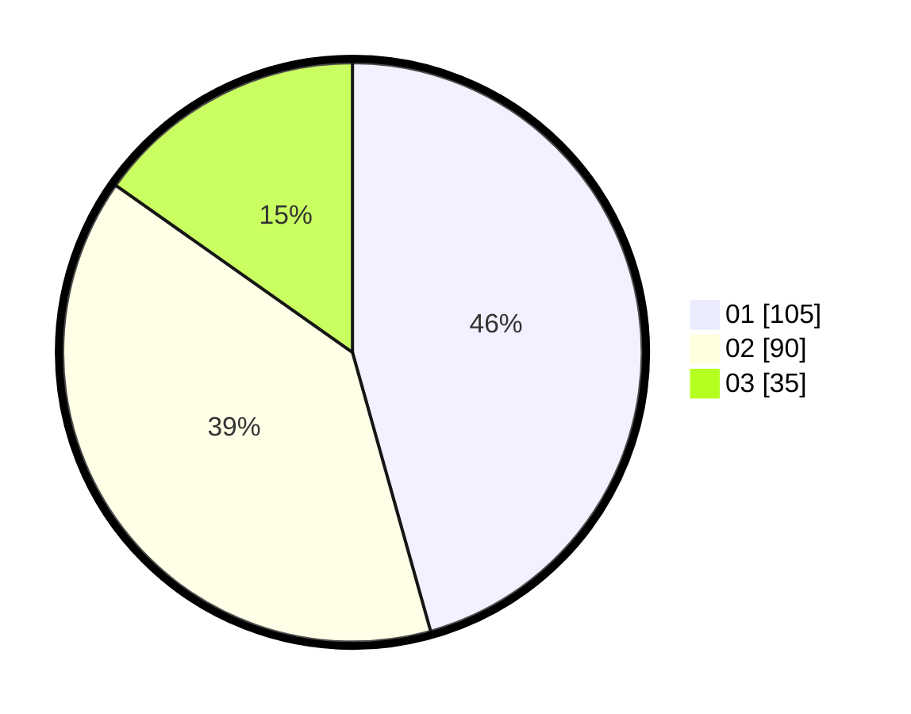

# Hasil

Hasil perolehan suara paslon dapat dilihat pada file paslon-01.txt, paslon-02.txt, dan paslon-03.txt.

Jika tidak ada, artinya data tersebut belum ada pada SIREKAP.

## Perolehan Suara

 * Paslon 01: **105**.
 * Paslon 02: **90**.
 * Paslon 03: **35**.

## Foto C Plano

https://sirekap-obj-formc.kpu.go.id/2343/pemilu/ppwp/31/74/09/10/06/3174091006110-20240214-155351--73a19557-bfa7-4df6-b8f0-6f77e9107396.jpg

https://sirekap-obj-formc.kpu.go.id/2343/pemilu/ppwp/31/74/09/10/06/3174091006110-20240214-155440--394fbf70-ac98-495b-a4e4-7b93b4ff4472.jpg

https://sirekap-obj-formc.kpu.go.id/2343/pemilu/ppwp/31/74/09/10/06/3174091006110-20240214-155505--660a585a-07ab-478e-b43d-e89e39fed39d.jpg

## DATA PEMILIH TETAP

Jumlah pemilih dalam DPT: **264**.
 * L: **123**.
 * P: **141**.

## DATA PENGGUNA HAK PILIH

Jumlah pengguna hak pilih dalam DPT: **217**.
 * L: **97**.
 * P: **120**.

Jumlah pengguna hak pilih dalam DPTb: **14**.
 * L: **8**.
 * P: **6**.

Jumlah pengguna hak pilih dalam DPK: **4**.
 * L: **2**.
 * P: **2**.

Jumlah pengguna hak pilih: **235**.
 * L: **107**.
 * P: **128**.

## JUMLAH SUARA SAH DAN TIDAK SAH

JUMLAH SELURUH SUARA SAH: **230**.

JUMLAH SUARA TIDAK SAH: **5**.

JUMLAH SELURUH SUARA SAH DAN SUARA TIDAK SAH: **235**.
