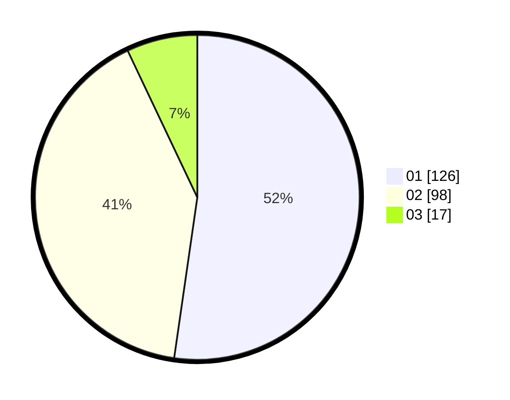

# Hasil

Hasil perolehan suara paslon dapat dilihat pada file paslon-01.txt, paslon-02.txt, dan paslon-03.txt.

Jika tidak ada, artinya data tersebut belum ada pada SIREKAP.

## Perolehan Suara

 * Paslon 01: **126**.
 * Paslon 02: **98**.
 * Paslon 03: **17**.

## Foto C Plano

https://sirekap-obj-formc.kpu.go.id/a434/pemilu/ppwp/31/74/09/10/06/3174091006113-20240214-223130--1a999cc8-add9-4bc7-a57b-8dce83d1bb74.jpg

https://sirekap-obj-formc.kpu.go.id/a434/pemilu/ppwp/31/74/09/10/06/3174091006113-20240214-223201--0c5cb675-2be4-4e16-b018-1d36a0cc8943.jpg

https://sirekap-obj-formc.kpu.go.id/a434/pemilu/ppwp/31/74/09/10/06/3174091006113-20240214-223223--81c61af8-5dc1-458b-a75c-615b276932fa.jpg

## DATA PEMILIH TETAP

Jumlah pemilih dalam DPT: **280**.
 * L: **146**.
 * P: **134**.

## DATA PENGGUNA HAK PILIH

Jumlah pengguna hak pilih dalam DPT: **224**.
 * L: **108**.
 * P: **116**.

Jumlah pengguna hak pilih dalam DPTb: **14**.
 * L: **5**.
 * P: **9**.

Jumlah pengguna hak pilih dalam DPK: **6**.
 * L: **1**.
 * P: **5**.

Jumlah pengguna hak pilih: **244**.
 * L: **114**.
 * P: **130**.

## JUMLAH SUARA SAH DAN TIDAK SAH

JUMLAH SELURUH SUARA SAH: **241**.

JUMLAH SUARA TIDAK SAH: **3**.

JUMLAH SELURUH SUARA SAH DAN SUARA TIDAK SAH: **244**.
