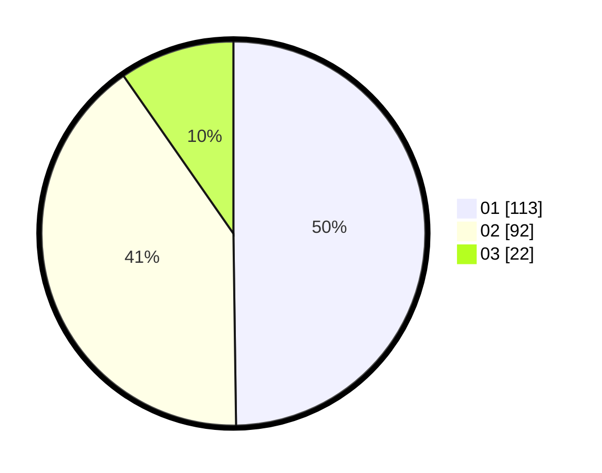

# Hasil

Hasil perolehan suara paslon dapat dilihat pada file paslon-01.txt, paslon-02.txt, dan paslon-03.txt.

Jika tidak ada, artinya data tersebut belum ada pada SIREKAP.

## Perolehan Suara

 * Paslon 01: **113**.
 * Paslon 02: **92**.
 * Paslon 03: **22**.

## Foto C Plano

https://sirekap-obj-formc.kpu.go.id/2ac4/pemilu/ppwp/31/74/09/10/06/3174091006122-20240214-223210--e1b155f6-dd1d-4c04-a498-b391ae449df0.jpg

https://sirekap-obj-formc.kpu.go.id/2ac4/pemilu/ppwp/31/74/09/10/06/3174091006122-20240214-223241--ab268e7d-1d2b-4b3e-a005-e99a622b2bc8.jpg

https://sirekap-obj-formc.kpu.go.id/2ac4/pemilu/ppwp/31/74/09/10/06/3174091006122-20240214-223309--cf093a02-e525-4e2d-942a-46aff1a9e954.jpg

## DATA PEMILIH TETAP

Jumlah pemilih dalam DPT: **241**.
 * L: **116**.
 * P: **125**.

## DATA PENGGUNA HAK PILIH

Jumlah pengguna hak pilih dalam DPT: **216**.
 * L: **99**.
 * P: **117**.

Jumlah pengguna hak pilih dalam DPTb: **1**.
 * L: **0**.
 * P: **1**.

Jumlah pengguna hak pilih dalam DPK: **0**.
 * L: **0**.
 * P: **0**.

Jumlah pengguna hak pilih: **229**.
 * L: **99**.
 * P: **117**.

## JUMLAH SUARA SAH DAN TIDAK SAH

JUMLAH SELURUH SUARA SAH: **227**.

JUMLAH SUARA TIDAK SAH: **2**.

JUMLAH SELURUH SUARA SAH DAN SUARA TIDAK SAH: **229**.
