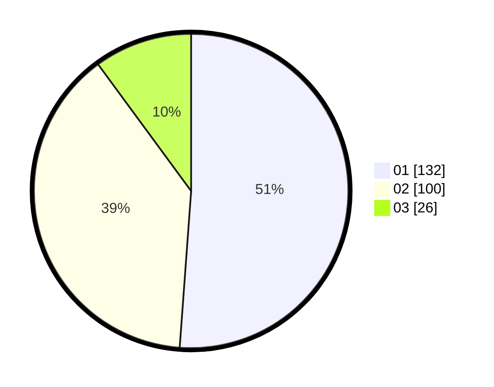

# Hasil

Hasil perolehan suara paslon dapat dilihat pada file paslon-01.txt, paslon-02.txt, dan paslon-03.txt.

Jika tidak ada, artinya data tersebut belum ada pada SIREKAP.

## Perolehan Suara

 * Paslon 01: **132**.
 * Paslon 02: **100**.
 * Paslon 03: **26**.

## Foto C Plano

https://sirekap-obj-formc.kpu.go.id/fe2f/pemilu/ppwp/31/74/09/10/06/3174091006128-20240215-005448--6e4d6c7c-f8fb-4c7f-9f64-67442e87fde4.jpg

https://sirekap-obj-formc.kpu.go.id/fe2f/pemilu/ppwp/31/74/09/10/06/3174091006128-20240215-005444--b837bd78-3a72-4cfc-a3a8-307686283689.jpg

https://sirekap-obj-formc.kpu.go.id/fe2f/pemilu/ppwp/31/74/09/10/06/3174091006128-20240215-005441--6755876d-8c8d-4fe2-90c1-70c29fdbb943.jpg
