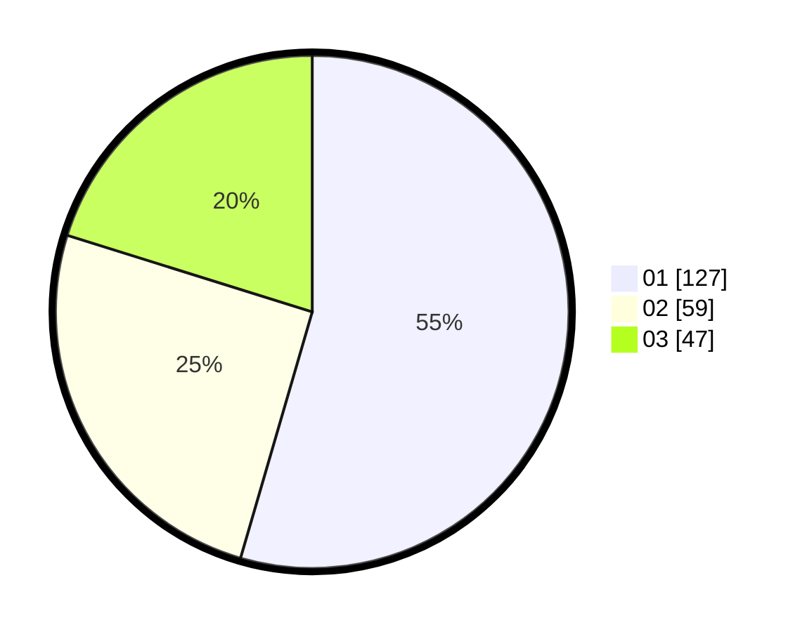

# Hasil

Hasil perolehan suara paslon dapat dilihat pada file paslon-01.txt, paslon-02.txt, dan paslon-03.txt.

Jika tidak ada, artinya data tersebut belum ada pada SIREKAP.

## Perolehan Suara

 * Paslon 01: **127**.
 * Paslon 02: **59**.
 * Paslon 03: **47**.

## Foto C Plano

https://sirekap-obj-formc.kpu.go.id/ecad/pemilu/ppwp/31/74/09/10/06/3174091006131-20240215-014831--308cd024-3533-4b1c-bc3c-11c299dda63f.jpg

https://sirekap-obj-formc.kpu.go.id/ecad/pemilu/ppwp/31/74/09/10/06/3174091006131-20240215-015022--7ec7444d-f07f-40ff-963c-a9255e75af59.jpg

https://sirekap-obj-formc.kpu.go.id/ecad/pemilu/ppwp/31/74/09/10/06/3174091006131-20240215-014924--310559b2-d75b-4973-b532-8750cea55217.jpg

## DATA PEMILIH TETAP

Jumlah pemilih dalam DPT: **254**.
 * L: **121**.
 * P: **133**.

## DATA PENGGUNA HAK PILIH

Jumlah pengguna hak pilih dalam DPT: **214**.
 * L: **100**.
 * P: **114**.

Jumlah pengguna hak pilih dalam DPTb: **19**.
 * L: **4**.
 * P: **15**.

Jumlah pengguna hak pilih dalam DPK: **1**.
 * L: **1**.
 * P: **0**.

Jumlah pengguna hak pilih: **234**.
 * L: **105**.
 * P: **129**.

## JUMLAH SUARA SAH DAN TIDAK SAH

JUMLAH SELURUH SUARA SAH: **233**.

JUMLAH SUARA TIDAK SAH: **1**.

JUMLAH SELURUH SUARA SAH DAN SUARA TIDAK SAH: **234**.
