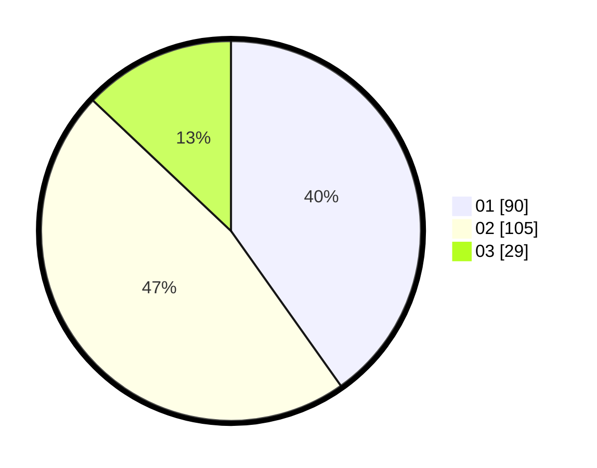

# Hasil

Hasil perolehan suara paslon dapat dilihat pada file paslon-01.txt, paslon-02.txt, dan paslon-03.txt.

Jika tidak ada, artinya data tersebut belum ada pada SIREKAP.

## Perolehan Suara

 * Paslon 01: **90**.
 * Paslon 02: **105**.
 * Paslon 03: **29**.

## Foto C Plano

https://sirekap-obj-formc.kpu.go.id/dd72/pemilu/ppwp/31/74/10/10/01/3174101001004-20240216-202533--44c37b8f-4a3e-42f0-8293-b77c1d4a4c98.jpg

https://sirekap-obj-formc.kpu.go.id/dd72/pemilu/ppwp/31/74/10/10/01/3174101001004-20240215-021755--4bc9bf4e-9db1-44b1-8bb9-98a73ff5fa3e.jpg

https://sirekap-obj-formc.kpu.go.id/dd72/pemilu/ppwp/31/74/10/10/01/3174101001004-20240215-021801--3e7cb374-bc5f-4c2e-8929-782a52a6d492.jpg
