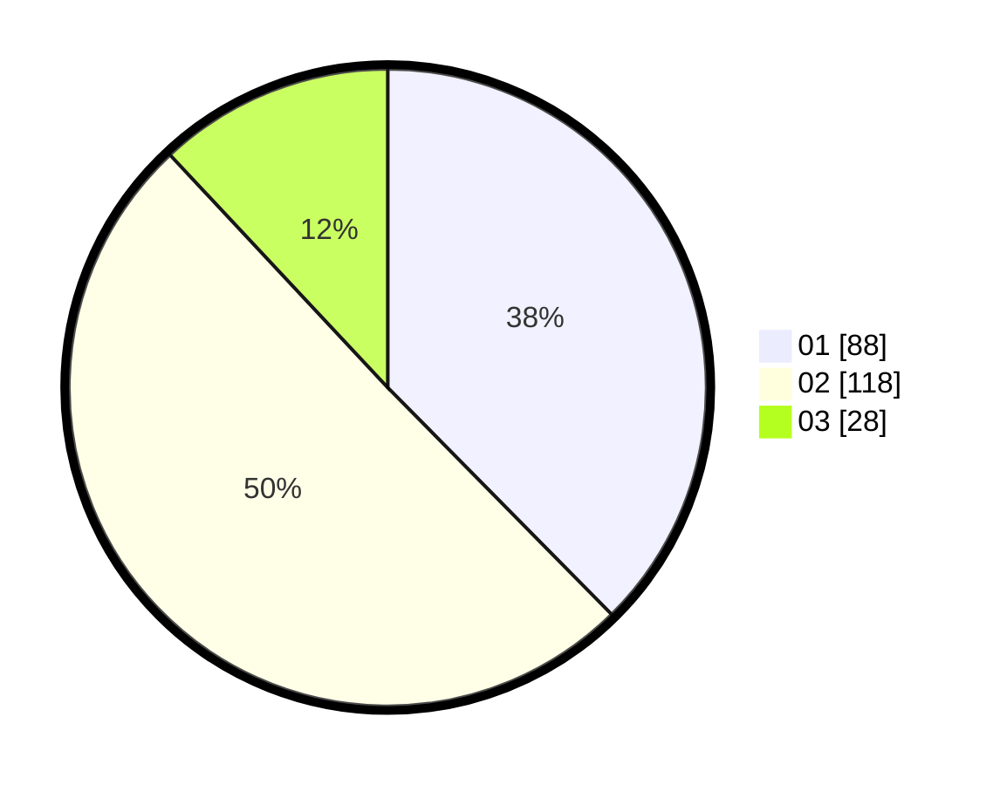

# Hasil

Hasil perolehan suara paslon dapat dilihat pada file paslon-01.txt, paslon-02.txt, dan paslon-03.txt.

Jika tidak ada, artinya data tersebut belum ada pada SIREKAP.

## Perolehan Suara

 * Paslon 01: **88**.
 * Paslon 02: **118**.
 * Paslon 03: **28**.

## Foto C Plano

https://sirekap-obj-formc.kpu.go.id/220c/pemilu/ppwp/31/74/10/10/01/3174101001005-20240215-210723--e2665bee-1bda-4f37-82f5-da3347340bcc.jpg

https://sirekap-obj-formc.kpu.go.id/220c/pemilu/ppwp/31/74/10/10/01/3174101001005-20240215-210724--9c1c5fc6-a1f7-4655-81ba-2dcd80b0893b.jpg

https://sirekap-obj-formc.kpu.go.id/220c/pemilu/ppwp/31/74/10/10/01/3174101001005-20240215-210724--a1648bda-3129-4914-9ea8-23ad16bfb658.jpg

## DATA PEMILIH TETAP

Jumlah pemilih dalam DPT: **264**.
 * L: **122**.
 * P: **142**.

## DATA PENGGUNA HAK PILIH

Jumlah pengguna hak pilih dalam DPT: **227**.
 * L: **107**.
 * P: **120**.

Jumlah pengguna hak pilih dalam DPTb: **5**.
 * L: **3**.
 * P: **2**.

Jumlah pengguna hak pilih dalam DPK: **3**.
 * L: **0**.
 * P: **3**.

Jumlah pengguna hak pilih: **235**.
 * L: **110**.
 * P: **125**.

## JUMLAH SUARA SAH DAN TIDAK SAH

JUMLAH SELURUH SUARA SAH: **234**.

JUMLAH SUARA TIDAK SAH: **1**.

JUMLAH SELURUH SUARA SAH DAN SUARA TIDAK SAH: **235**.
