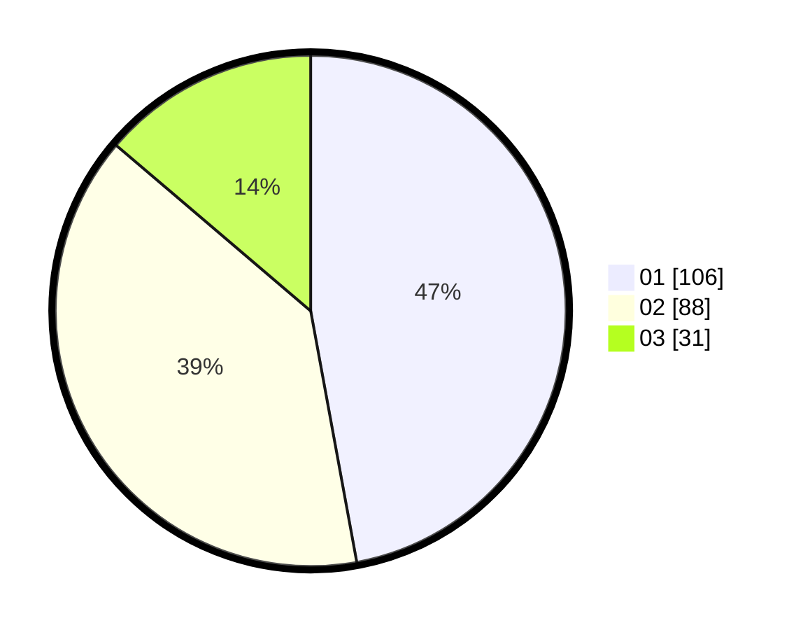

# Hasil

Hasil perolehan suara paslon dapat dilihat pada file paslon-01.txt, paslon-02.txt, dan paslon-03.txt.

Jika tidak ada, artinya data tersebut belum ada pada SIREKAP.

## Perolehan Suara

 * Paslon 01: **106**.
 * Paslon 02: **88**.
 * Paslon 03: **31**.

## Foto C Plano

https://sirekap-obj-formc.kpu.go.id/f1b7/pemilu/ppwp/31/74/10/10/01/3174101001013-20240214-205447--7ef9f34f-7c9d-41d8-84b2-34fb2db0f3ad.jpg

https://sirekap-obj-formc.kpu.go.id/f1b7/pemilu/ppwp/31/74/10/10/01/3174101001013-20240214-203053--6d5ab190-0eaa-4930-bad5-05be4ecb7eb2.jpg

https://sirekap-obj-formc.kpu.go.id/f1b7/pemilu/ppwp/31/74/10/10/01/3174101001013-20240214-203455--ed6e81f2-af6c-4b60-b52e-c854b7563f94.jpg

## DATA PEMILIH TETAP

Jumlah pemilih dalam DPT: **277**.
 * L: **141**.
 * P: **136**.

## DATA PENGGUNA HAK PILIH

Jumlah pengguna hak pilih dalam DPT: **229**.
 * L: **113**.
 * P: **116**.

Jumlah pengguna hak pilih dalam DPTb: **0**.
 * L: **0**.
 * P: **0**.

Jumlah pengguna hak pilih dalam DPK: **0**.
 * L: **0**.
 * P: **0**.

Jumlah pengguna hak pilih: **229**.
 * L: **113**.
 * P: **116**.

## JUMLAH SUARA SAH DAN TIDAK SAH

JUMLAH SELURUH SUARA SAH: **225**.

JUMLAH SUARA TIDAK SAH: **4**.

JUMLAH SELURUH SUARA SAH DAN SUARA TIDAK SAH: **229**.
