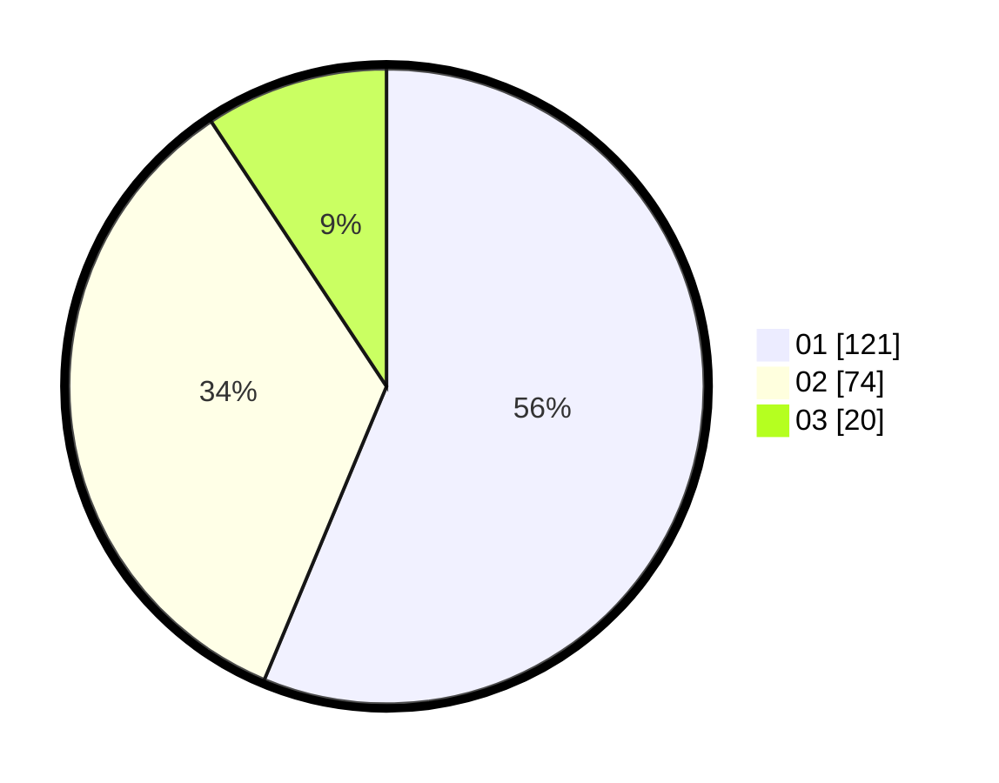

# Hasil

Hasil perolehan suara paslon dapat dilihat pada file paslon-01.txt, paslon-02.txt, dan paslon-03.txt.

Jika tidak ada, artinya data tersebut belum ada pada SIREKAP.

## Perolehan Suara

 * Paslon 01: **121**.
 * Paslon 02: **74**.
 * Paslon 03: **20**.

## Foto C Plano

https://sirekap-obj-formc.kpu.go.id/3470/pemilu/ppwp/31/74/10/10/01/3174101001023-20240214-202048--c128bfa6-06c8-493a-98d4-75d51f653e96.jpg

https://sirekap-obj-formc.kpu.go.id/3470/pemilu/ppwp/31/74/10/10/01/3174101001023-20240214-202102--285e47fd-a90d-4dde-81b9-dd72d47a0392.jpg

https://sirekap-obj-formc.kpu.go.id/3470/pemilu/ppwp/31/74/10/10/01/3174101001023-20240214-223830--50a263d6-075a-4483-9386-34020d8908f2.jpg

## DATA PEMILIH TETAP

Jumlah pemilih dalam DPT: **272**.
 * L: **129**.
 * P: **143**.

## DATA PENGGUNA HAK PILIH

Jumlah pengguna hak pilih dalam DPT: **217**.
 * L: **102**.
 * P: **115**.

Jumlah pengguna hak pilih dalam DPTb: **0**.
 * L: **0**.
 * P: **0**.

Jumlah pengguna hak pilih dalam DPK: **0**.
 * L: **0**.
 * P: **0**.

Jumlah pengguna hak pilih: **217**.
 * L: **102**.
 * P: **115**.

## JUMLAH SUARA SAH DAN TIDAK SAH

JUMLAH SELURUH SUARA SAH: **215**.

JUMLAH SUARA TIDAK SAH: **2**.

JUMLAH SELURUH SUARA SAH DAN SUARA TIDAK SAH: **217**.
