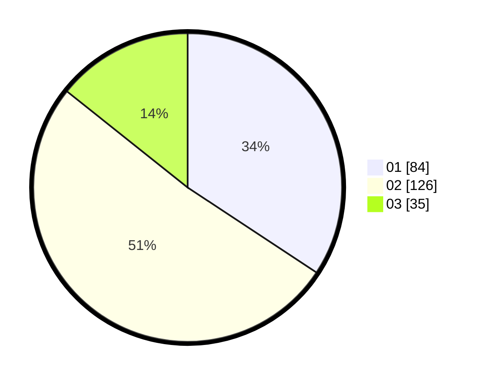

# Hasil

Hasil perolehan suara paslon dapat dilihat pada file paslon-01.txt, paslon-02.txt, dan paslon-03.txt.

Jika tidak ada, artinya data tersebut belum ada pada SIREKAP.

## Perolehan Suara

 * Paslon 01: **84**.
 * Paslon 02: **126**.
 * Paslon 03: **35**.

## Foto C Plano

https://sirekap-obj-formc.kpu.go.id/ef41/pemilu/ppwp/31/74/10/10/01/3174101001052-20240214-160055--18600c1b-00e6-482a-bbed-f7110eb8c2a5.jpg

https://sirekap-obj-formc.kpu.go.id/ef41/pemilu/ppwp/31/74/10/10/01/3174101001052-20240214-155100--b74a527b-e070-44d8-a13c-176e6515ecb1.jpg

https://sirekap-obj-formc.kpu.go.id/ef41/pemilu/ppwp/31/74/10/10/01/3174101001052-20240214-155357--b9aa83c1-e933-495d-ab14-c4f451f92c11.jpg

## DATA PEMILIH TETAP

Jumlah pemilih dalam DPT: **295**.
 * L: **139**.
 * P: **156**.

## DATA PENGGUNA HAK PILIH

Jumlah pengguna hak pilih dalam DPT: **234**.
 * L: **107**.
 * P: **127**.

Jumlah pengguna hak pilih dalam DPTb: **4**.
 * L: **0**.
 * P: **4**.

Jumlah pengguna hak pilih dalam DPK: **10**.
 * L: **8**.
 * P: **2**.

Jumlah pengguna hak pilih: **248**.
 * L: **115**.
 * P: **133**.

## JUMLAH SUARA SAH DAN TIDAK SAH

JUMLAH SELURUH SUARA SAH: **245**.

JUMLAH SUARA TIDAK SAH: **3**.

JUMLAH SELURUH SUARA SAH DAN SUARA TIDAK SAH: **248**.
