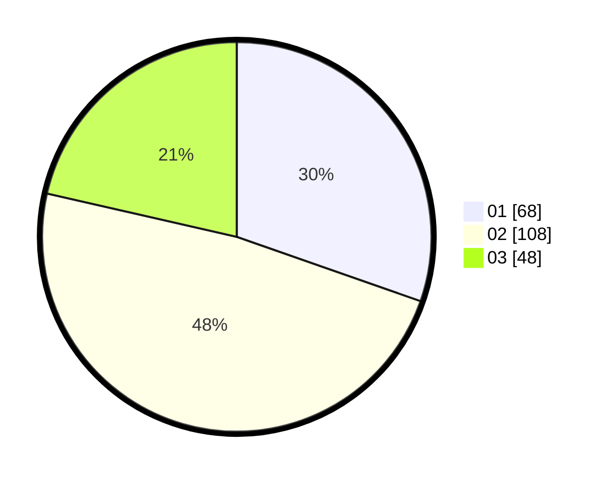

# Hasil

Hasil perolehan suara paslon dapat dilihat pada file paslon-01.txt, paslon-02.txt, dan paslon-03.txt.

Jika tidak ada, artinya data tersebut belum ada pada SIREKAP.

## Perolehan Suara

 * Paslon 01: **68**.
 * Paslon 02: **108**.
 * Paslon 03: **48**.

## Foto C Plano

https://sirekap-obj-formc.kpu.go.id/4809/pemilu/ppwp/31/74/10/10/01/3174101001062-20240214-185755--6bf91e46-fe8b-4da5-9839-0e21f24256d1.jpg

https://sirekap-obj-formc.kpu.go.id/4809/pemilu/ppwp/31/74/10/10/01/3174101001062-20240214-190010--e9fca7d2-fd75-4a77-b6e7-4c5787b8e627.jpg

https://sirekap-obj-formc.kpu.go.id/4809/pemilu/ppwp/31/74/10/10/01/3174101001062-20240214-190135--1d89cb2e-3643-47f2-871f-79b7bcd96059.jpg

## DATA PEMILIH TETAP

Jumlah pemilih dalam DPT: **255**.
 * L: **120**.
 * P: **135**.

## DATA PENGGUNA HAK PILIH

Jumlah pengguna hak pilih dalam DPT: **223**.
 * L: **100**.
 * P: **123**.

Jumlah pengguna hak pilih dalam DPTb: **3**.
 * L: **1**.
 * P: **2**.

Jumlah pengguna hak pilih dalam DPK: **1**.
 * L: **1**.
 * P: **0**.

Jumlah pengguna hak pilih: **227**.
 * L: **102**.
 * P: **125**.

## JUMLAH SUARA SAH DAN TIDAK SAH

JUMLAH SELURUH SUARA SAH: **224**.

JUMLAH SUARA TIDAK SAH: **3**.

JUMLAH SELURUH SUARA SAH DAN SUARA TIDAK SAH: **227**.
