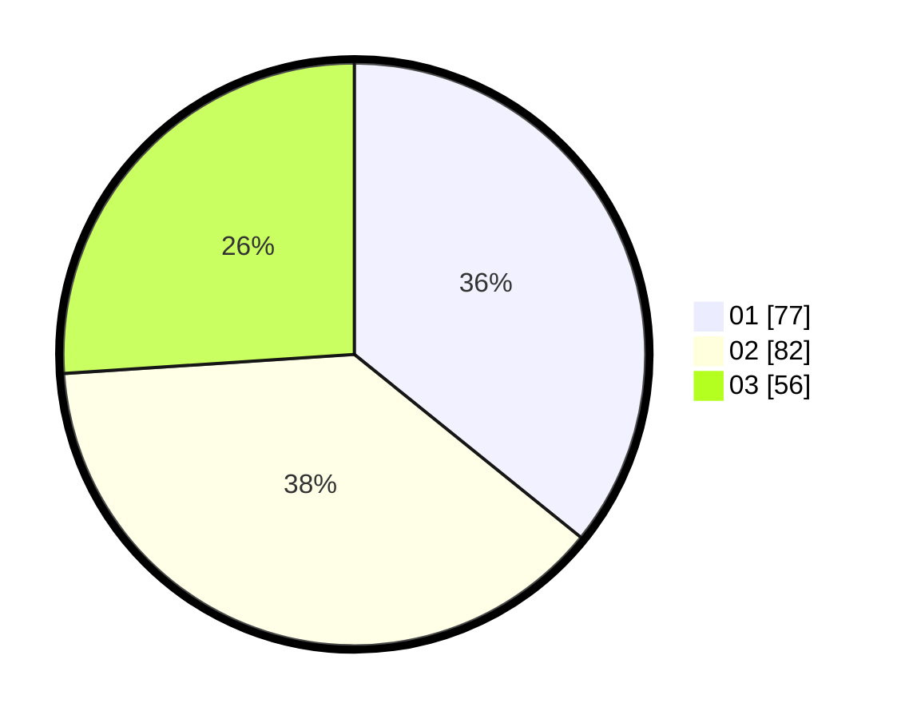

# Hasil

Hasil perolehan suara paslon dapat dilihat pada file paslon-01.txt, paslon-02.txt, dan paslon-03.txt.

Jika tidak ada, artinya data tersebut belum ada pada SIREKAP.

## Perolehan Suara

 * Paslon 01: **77**.
 * Paslon 02: **82**.
 * Paslon 03: **56**.

## Foto C Plano

https://sirekap-obj-formc.kpu.go.id/7927/pemilu/ppwp/31/74/10/10/01/3174101001064-20240214-193813--67fe67d1-5dcf-4923-880b-6ded5c53e596.jpg

https://sirekap-obj-formc.kpu.go.id/7927/pemilu/ppwp/31/74/10/10/01/3174101001064-20240214-193820--286ae2ae-f74f-4e8b-9867-db0367d1d764.jpg

https://sirekap-obj-formc.kpu.go.id/7927/pemilu/ppwp/31/74/10/10/01/3174101001064-20240214-193826--f5768b49-98ad-453d-a893-6b2b45c63d27.jpg
