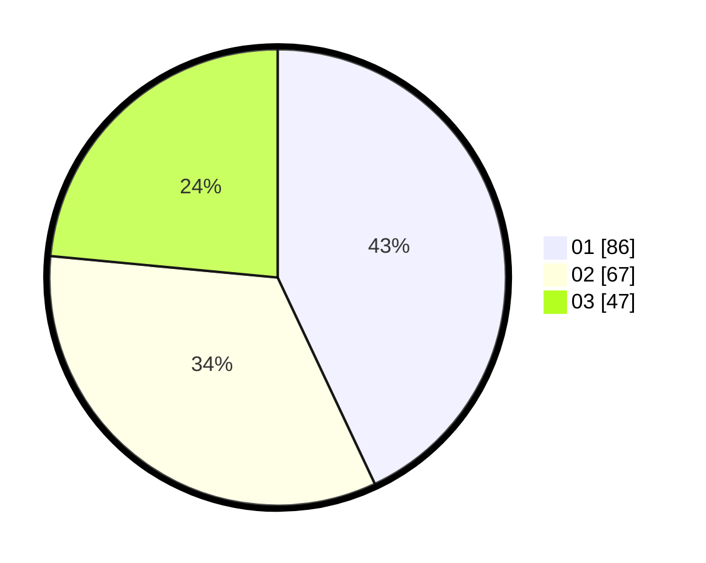

# Hasil

Hasil perolehan suara paslon dapat dilihat pada file paslon-01.txt, paslon-02.txt, dan paslon-03.txt.

Jika tidak ada, artinya data tersebut belum ada pada SIREKAP.

## Perolehan Suara

 * Paslon 01: **86**.
 * Paslon 02: **67**.
 * Paslon 03: **47**.

## Foto C Plano

https://sirekap-obj-formc.kpu.go.id/a57e/pemilu/ppwp/31/74/10/10/01/3174101001065-20240214-141448--9a2ef5c8-8479-4e31-9ae7-99a31024852b.jpg

https://sirekap-obj-formc.kpu.go.id/a57e/pemilu/ppwp/31/74/10/10/01/3174101001065-20240214-141630--0baa5de9-8b73-4d8d-8a49-85cfcfb63041.jpg

https://sirekap-obj-formc.kpu.go.id/a57e/pemilu/ppwp/31/74/10/10/01/3174101001065-20240214-141733--50ee6c43-d2b8-4fa3-ab0a-3a6cde96d7b4.jpg
