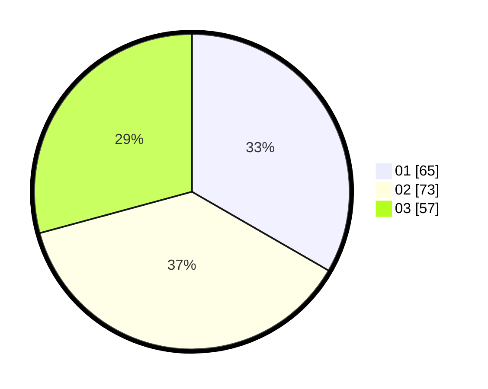

# Hasil

Hasil perolehan suara paslon dapat dilihat pada file paslon-01.txt, paslon-02.txt, dan paslon-03.txt.

Jika tidak ada, artinya data tersebut belum ada pada SIREKAP.

## Perolehan Suara

 * Paslon 01: **65**.
 * Paslon 02: **73**.
 * Paslon 03: **57**.

## Foto C Plano

https://sirekap-obj-formc.kpu.go.id/a630/pemilu/ppwp/31/74/10/10/01/3174101001066-20240214-190027--3e85b9d2-caa4-418b-8811-91afe43dba5a.jpg

https://sirekap-obj-formc.kpu.go.id/a630/pemilu/ppwp/31/74/10/10/01/3174101001066-20240214-190030--46d0c428-b87a-4a3b-9639-f860adf08285.jpg

https://sirekap-obj-formc.kpu.go.id/a630/pemilu/ppwp/31/74/10/10/01/3174101001066-20240214-190033--e8611ba4-0b11-4fe7-9850-3e7d20405ad8.jpg

## DATA PEMILIH TETAP

Jumlah pemilih dalam DPT: **233**.
 * L: **105**.
 * P: **128**.

## DATA PENGGUNA HAK PILIH

Jumlah pengguna hak pilih dalam DPT: **190**.
 * L: **83**.
 * P: **107**.

Jumlah pengguna hak pilih dalam DPTb: **3**.
 * L: **0**.
 * P: **3**.

Jumlah pengguna hak pilih dalam DPK: **5**.
 * L: **2**.
 * P: **3**.

Jumlah pengguna hak pilih: **198**.
 * L: **85**.
 * P: **113**.

## JUMLAH SUARA SAH DAN TIDAK SAH

JUMLAH SELURUH SUARA SAH: **195**.

JUMLAH SUARA TIDAK SAH: **3**.

JUMLAH SELURUH SUARA SAH DAN SUARA TIDAK SAH: **198**.
