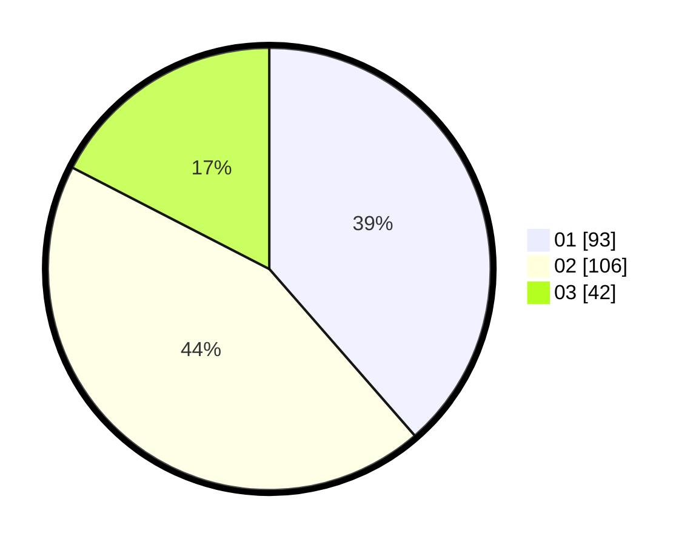

# Hasil

Hasil perolehan suara paslon dapat dilihat pada file paslon-01.txt, paslon-02.txt, dan paslon-03.txt.

Jika tidak ada, artinya data tersebut belum ada pada SIREKAP.

## Perolehan Suara

 * Paslon 01: **93**.
 * Paslon 02: **106**.
 * Paslon 03: **42**.

## Foto C Plano

https://sirekap-obj-formc.kpu.go.id/089a/pemilu/ppwp/31/74/10/10/01/3174101001076-20240216-180628--91fa5833-e6db-4a7c-ac9f-199e5431e4cc.jpg

https://sirekap-obj-formc.kpu.go.id/089a/pemilu/ppwp/31/74/10/10/01/3174101001076-20240214-202746--4ac0a245-be0c-4f5e-82af-b6400de0e928.jpg

https://sirekap-obj-formc.kpu.go.id/089a/pemilu/ppwp/31/74/10/10/01/3174101001076-20240214-202944--6aba8321-1b90-4ad3-b1db-1a505615a55d.jpg
