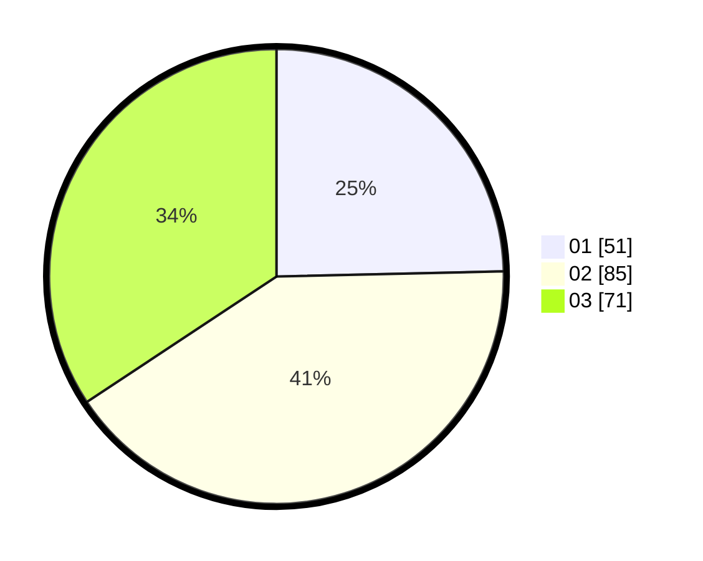

# Hasil

Hasil perolehan suara paslon dapat dilihat pada file paslon-01.txt, paslon-02.txt, dan paslon-03.txt.

Jika tidak ada, artinya data tersebut belum ada pada SIREKAP.

## Perolehan Suara

 * Paslon 01: **51**.
 * Paslon 02: **85**.
 * Paslon 03: **71**.

## Foto C Plano

https://sirekap-obj-formc.kpu.go.id/2fdb/pemilu/ppwp/31/74/10/10/01/3174101001088-20240214-201806--aaa40c40-3de8-4254-9c04-1eec693f1c3b.jpg

https://sirekap-obj-formc.kpu.go.id/2fdb/pemilu/ppwp/31/74/10/10/01/3174101001088-20240214-201820--6486d346-e4db-431a-b7c0-f42a979d9d54.jpg

https://sirekap-obj-formc.kpu.go.id/2fdb/pemilu/ppwp/31/74/10/10/01/3174101001088-20240214-201836--178d5c27-59cb-4f5f-820c-c31820e2f5c9.jpg

## DATA PEMILIH TETAP

Jumlah pemilih dalam DPT: **250**.
 * L: **111**.
 * P: **139**.

## DATA PENGGUNA HAK PILIH

Jumlah pengguna hak pilih dalam DPT: **211**.
 * L: **93**.
 * P: **118**.

Jumlah pengguna hak pilih dalam DPTb: **0**.
 * L: **0**.
 * P: **0**.

Jumlah pengguna hak pilih dalam DPK: **0**.
 * L: **0**.
 * P: **0**.

Jumlah pengguna hak pilih: **211**.
 * L: **93**.
 * P: **118**.

## JUMLAH SUARA SAH DAN TIDAK SAH

JUMLAH SELURUH SUARA SAH: **207**.

JUMLAH SUARA TIDAK SAH: **4**.

JUMLAH SELURUH SUARA SAH DAN SUARA TIDAK SAH: **211**.
