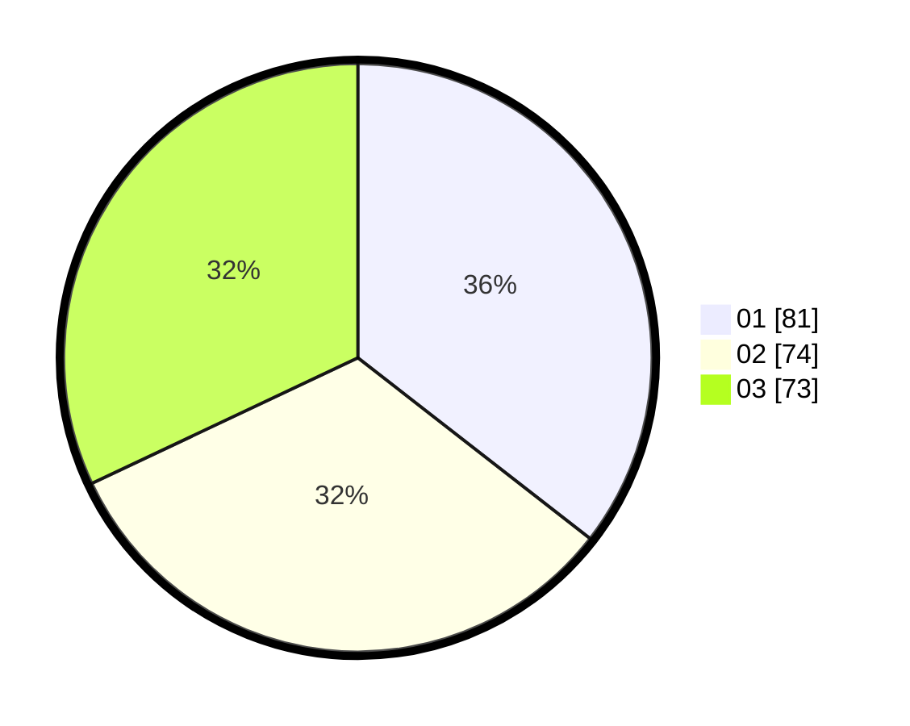

# Hasil

Hasil perolehan suara paslon dapat dilihat pada file paslon-01.txt, paslon-02.txt, dan paslon-03.txt.

Jika tidak ada, artinya data tersebut belum ada pada SIREKAP.

## Perolehan Suara

 * Paslon 01: **81**.
 * Paslon 02: **74**.
 * Paslon 03: **73**.

## Foto C Plano

https://sirekap-obj-formc.kpu.go.id/e40c/pemilu/ppwp/31/74/10/10/01/3174101001093-20240214-191156--062a292c-c46a-4a2f-8837-9995adebf61a.jpg

https://sirekap-obj-formc.kpu.go.id/e40c/pemilu/ppwp/31/74/10/10/01/3174101001093-20240214-201304--37465c5d-da6d-4fbc-9da1-dd460ac003ba.jpg

https://sirekap-obj-formc.kpu.go.id/e40c/pemilu/ppwp/31/74/10/10/01/3174101001093-20240214-191542--95b84ce4-761e-41f3-8caa-e149df4ba55b.jpg

## DATA PEMILIH TETAP

Jumlah pemilih dalam DPT: **268**.
 * L: **126**.
 * P: **142**.

## DATA PENGGUNA HAK PILIH

Jumlah pengguna hak pilih dalam DPT: **236**.
 * L: **109**.
 * P: **127**.

Jumlah pengguna hak pilih dalam DPTb: **5**.
 * L: **1**.
 * P: **4**.

Jumlah pengguna hak pilih dalam DPK: **4**.
 * L: **3**.
 * P: **1**.

Jumlah pengguna hak pilih: **245**.
 * L: **113**.
 * P: **132**.

## JUMLAH SUARA SAH DAN TIDAK SAH

JUMLAH SELURUH SUARA SAH: **228**.

JUMLAH SUARA TIDAK SAH: **8**.

JUMLAH SELURUH SUARA SAH DAN SUARA TIDAK SAH: **236**.
