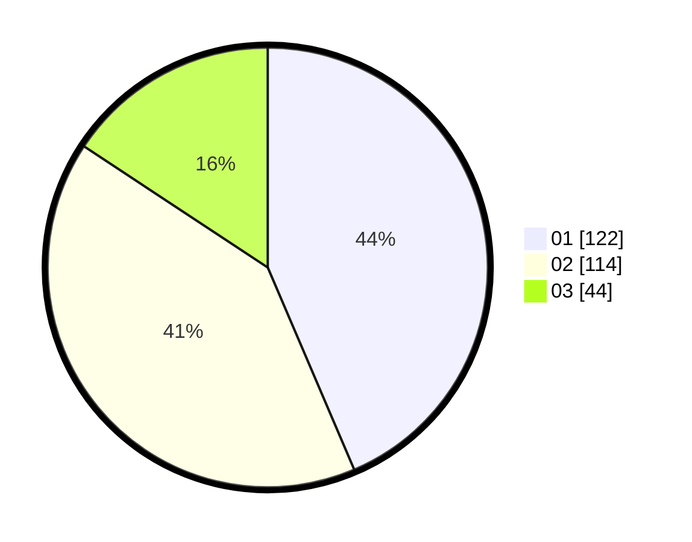

# Hasil

Hasil perolehan suara paslon dapat dilihat pada file paslon-01.txt, paslon-02.txt, dan paslon-03.txt.

Jika tidak ada, artinya data tersebut belum ada pada SIREKAP.

## Perolehan Suara

 * Paslon 01: **122**.
 * Paslon 02: **114**.
 * Paslon 03: **44**.

## Foto C Plano

https://sirekap-obj-formc.kpu.go.id/ec34/pemilu/ppwp/31/74/10/10/02/3174101002001-20240216-170428--8488a6f4-a9f6-4095-8956-cb8a02404488.jpg

https://sirekap-obj-formc.kpu.go.id/ec34/pemilu/ppwp/31/74/10/10/02/3174101002001-20240216-170503--a9af7b5e-6066-466d-a447-86402211bcf7.jpg

https://sirekap-obj-formc.kpu.go.id/ec34/pemilu/ppwp/31/74/10/10/02/3174101002001-20240216-170619--6fb92e31-88d2-41ba-bc6c-1da2d646ea5e.jpg

## DATA PEMILIH TETAP

Jumlah pemilih dalam DPT: **298**.
 * L: **149**.
 * P: **149**.

## DATA PENGGUNA HAK PILIH

Jumlah pengguna hak pilih dalam DPT: **256**.
 * L: **128**.
 * P: **128**.

Jumlah pengguna hak pilih dalam DPTb: **12**.
 * L: **1**.
 * P: **11**.

Jumlah pengguna hak pilih dalam DPK: **14**.
 * L: **4**.
 * P: **10**.

Jumlah pengguna hak pilih: **282**.
 * L: **133**.
 * P: **149**.

## JUMLAH SUARA SAH DAN TIDAK SAH

JUMLAH SELURUH SUARA SAH: **280**.

JUMLAH SUARA TIDAK SAH: **2**.

JUMLAH SELURUH SUARA SAH DAN SUARA TIDAK SAH: **282**.
