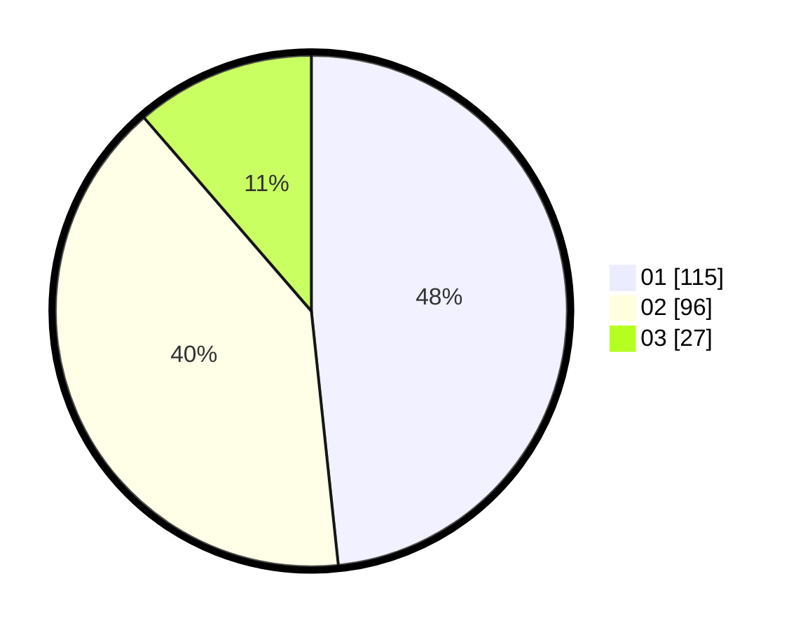

# Hasil

Hasil perolehan suara paslon dapat dilihat pada file paslon-01.txt, paslon-02.txt, dan paslon-03.txt.

Jika tidak ada, artinya data tersebut belum ada pada SIREKAP.

## Perolehan Suara

 * Paslon 01: **115**.
 * Paslon 02: **96**.
 * Paslon 03: **27**.

## Foto C Plano

https://sirekap-obj-formc.kpu.go.id/5c2a/pemilu/ppwp/31/74/10/10/02/3174101002005-20240214-162236--2bdd9061-b199-441b-ab4a-518fa623174a.jpg

https://sirekap-obj-formc.kpu.go.id/5c2a/pemilu/ppwp/31/74/10/10/02/3174101002005-20240214-155157--a17a3338-065d-40a5-8807-bc9b18e3c9c5.jpg

https://sirekap-obj-formc.kpu.go.id/5c2a/pemilu/ppwp/31/74/10/10/02/3174101002005-20240214-155159--f68463e6-788f-4e09-9842-1f727c359ee9.jpg

## DATA PEMILIH TETAP

Jumlah pemilih dalam DPT: **297**.
 * L: **150**.
 * P: **147**.

## DATA PENGGUNA HAK PILIH

Jumlah pengguna hak pilih dalam DPT: **239**.
 * L: **116**.
 * P: **123**.

Jumlah pengguna hak pilih dalam DPTb: **4**.
 * L: **2**.
 * P: **2**.

Jumlah pengguna hak pilih dalam DPK: **1**.
 * L: **0**.
 * P: **1**.

Jumlah pengguna hak pilih: **244**.
 * L: **118**.
 * P: **126**.

## JUMLAH SUARA SAH DAN TIDAK SAH

JUMLAH SELURUH SUARA SAH: **238**.

JUMLAH SUARA TIDAK SAH: **6**.

JUMLAH SELURUH SUARA SAH DAN SUARA TIDAK SAH: **244**.
