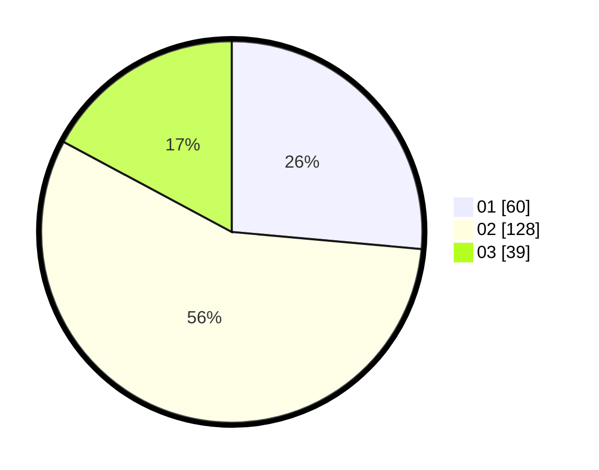

# Hasil

Hasil perolehan suara paslon dapat dilihat pada file paslon-01.txt, paslon-02.txt, dan paslon-03.txt.

Jika tidak ada, artinya data tersebut belum ada pada SIREKAP.

## Perolehan Suara

 * Paslon 01: **60**.
 * Paslon 02: **128**.
 * Paslon 03: **39**.

## Foto C Plano

https://sirekap-obj-formc.kpu.go.id/7df1/pemilu/ppwp/31/74/10/10/02/3174101002013-20240216-131646--9c0b5665-15b9-448b-8c7f-47ba5ea49b81.jpg

https://sirekap-obj-formc.kpu.go.id/7df1/pemilu/ppwp/31/74/10/10/02/3174101002013-20240216-131647--db47fdc5-64e9-4a71-a22f-70a1bed73079.jpg

https://sirekap-obj-formc.kpu.go.id/7df1/pemilu/ppwp/31/74/10/10/02/3174101002013-20240216-131646--c034a3a2-6748-48c2-b043-535f14227ddb.jpg

## DATA PEMILIH TETAP

Jumlah pemilih dalam DPT: **268**.
 * L: **124**.
 * P: **144**.

## DATA PENGGUNA HAK PILIH

Jumlah pengguna hak pilih dalam DPT: **229**.
 * L: **105**.
 * P: **124**.

Jumlah pengguna hak pilih dalam DPTb: **0**.
 * L: **0**.
 * P: **0**.

Jumlah pengguna hak pilih dalam DPK: **0**.
 * L: **0**.
 * P: **0**.

Jumlah pengguna hak pilih: **229**.
 * L: **105**.
 * P: **124**.

## JUMLAH SUARA SAH DAN TIDAK SAH

JUMLAH SELURUH SUARA SAH: **227**.

JUMLAH SUARA TIDAK SAH: **2**.

JUMLAH SELURUH SUARA SAH DAN SUARA TIDAK SAH: **229**.
