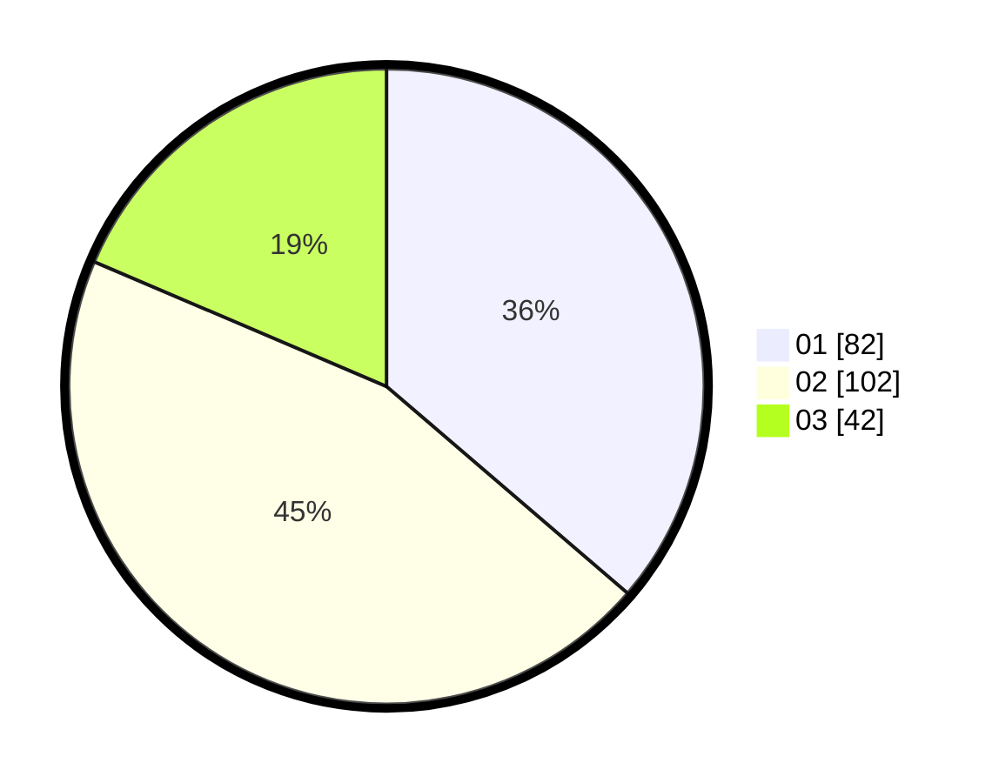

# Hasil

Hasil perolehan suara paslon dapat dilihat pada file paslon-01.txt, paslon-02.txt, dan paslon-03.txt.

Jika tidak ada, artinya data tersebut belum ada pada SIREKAP.

## Perolehan Suara

 * Paslon 01: **82**.
 * Paslon 02: **102**.
 * Paslon 03: **42**.

## Foto C Plano

https://sirekap-obj-formc.kpu.go.id/fbcb/pemilu/ppwp/31/74/10/10/02/3174101002031-20240216-151121--6a91eef7-2ac3-402f-a3a3-92a398b4d850.jpg

https://sirekap-obj-formc.kpu.go.id/fbcb/pemilu/ppwp/31/74/10/10/02/3174101002031-20240216-151122--6e6adacb-2d27-480c-ad78-6c1b45c37110.jpg

https://sirekap-obj-formc.kpu.go.id/fbcb/pemilu/ppwp/31/74/10/10/02/3174101002031-20240216-151121--98d23974-fea9-4ff2-b26c-b6524f76bac0.jpg

## DATA PEMILIH TETAP

Jumlah pemilih dalam DPT: **256**.
 * L: **122**.
 * P: **134**.

## DATA PENGGUNA HAK PILIH

Jumlah pengguna hak pilih dalam DPT: **213**.
 * L: **102**.
 * P: **111**.

Jumlah pengguna hak pilih dalam DPTb: **14**.
 * L: **7**.
 * P: **7**.

Jumlah pengguna hak pilih dalam DPK: **3**.
 * L: **1**.
 * P: **2**.

Jumlah pengguna hak pilih: **230**.
 * L: **120**.
 * P: **110**.

## JUMLAH SUARA SAH DAN TIDAK SAH

JUMLAH SELURUH SUARA SAH: **226**.

JUMLAH SUARA TIDAK SAH: **3**.

JUMLAH SELURUH SUARA SAH DAN SUARA TIDAK SAH: **229**.
