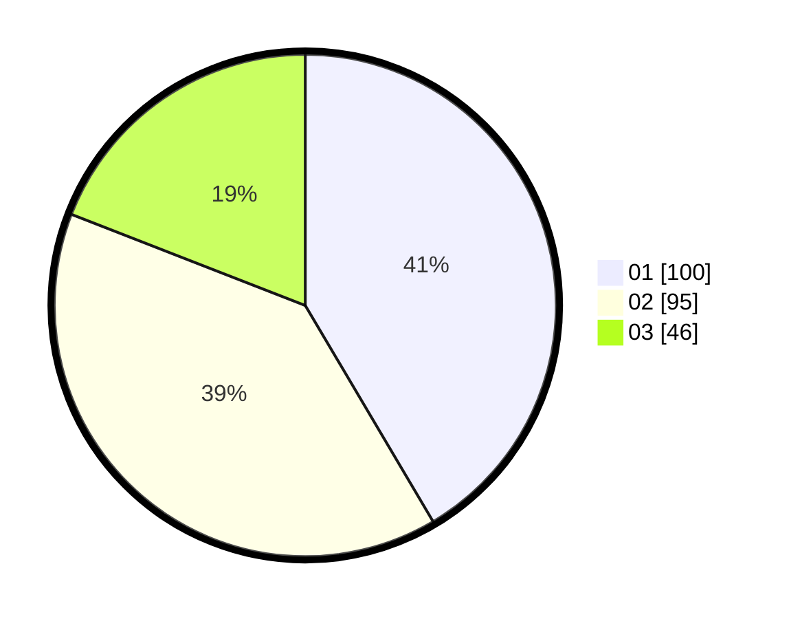

# Hasil

Hasil perolehan suara paslon dapat dilihat pada file paslon-01.txt, paslon-02.txt, dan paslon-03.txt.

Jika tidak ada, artinya data tersebut belum ada pada SIREKAP.

## Perolehan Suara

 * Paslon 01: **100**.
 * Paslon 02: **95**.
 * Paslon 03: **46**.

## Foto C Plano

https://sirekap-obj-formc.kpu.go.id/fcfa/pemilu/ppwp/31/74/10/10/02/3174101002032-20240216-144036--162f13b4-4632-4198-a6ce-e6716fcb0a9b.jpg

https://sirekap-obj-formc.kpu.go.id/fcfa/pemilu/ppwp/31/74/10/10/02/3174101002032-20240216-144037--676edbc6-c5cc-4284-a335-4b51020cd678.jpg

https://sirekap-obj-formc.kpu.go.id/fcfa/pemilu/ppwp/31/74/10/10/02/3174101002032-20240216-144037--c63372ad-1bd0-4342-b668-a7289e2dfb3a.jpg

## DATA PEMILIH TETAP

Jumlah pemilih dalam DPT: **280**.
 * L: **138**.
 * P: **142**.

## DATA PENGGUNA HAK PILIH

Jumlah pengguna hak pilih dalam DPT: **212**.
 * L: **108**.
 * P: **104**.

Jumlah pengguna hak pilih dalam DPTb: **22**.
 * L: **7**.
 * P: **15**.

Jumlah pengguna hak pilih dalam DPK: **9**.
 * L: **3**.
 * P: **6**.

Jumlah pengguna hak pilih: **243**.
 * L: **118**.
 * P: **125**.

## JUMLAH SUARA SAH DAN TIDAK SAH

JUMLAH SELURUH SUARA SAH: **241**.

JUMLAH SUARA TIDAK SAH: **2**.

JUMLAH SELURUH SUARA SAH DAN SUARA TIDAK SAH: **243**.
