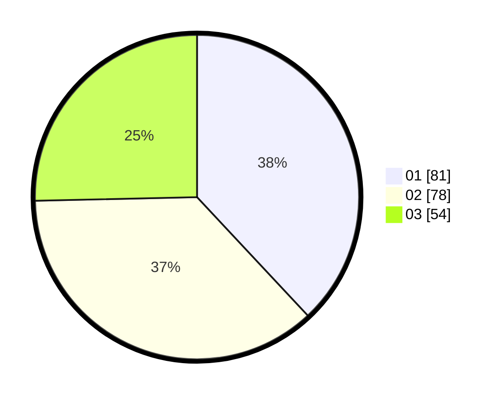

# Hasil

Hasil perolehan suara paslon dapat dilihat pada file paslon-01.txt, paslon-02.txt, dan paslon-03.txt.

Jika tidak ada, artinya data tersebut belum ada pada SIREKAP.

## Perolehan Suara

 * Paslon 01: **81**.
 * Paslon 02: **78**.
 * Paslon 03: **54**.

## Foto C Plano

https://sirekap-obj-formc.kpu.go.id/06d7/pemilu/ppwp/31/74/10/10/02/3174101002064-20240216-090127--5af05483-f49c-4d7a-a86a-601381089edf.jpg

https://sirekap-obj-formc.kpu.go.id/06d7/pemilu/ppwp/31/74/10/10/02/3174101002064-20240216-090129--015d473b-af22-4450-a52a-0e721f333a38.jpg

https://sirekap-obj-formc.kpu.go.id/06d7/pemilu/ppwp/31/74/10/10/02/3174101002064-20240216-090128--a6c9850f-2b8a-459c-9fff-fa8c23f8ea25.jpg

## DATA PEMILIH TETAP

Jumlah pemilih dalam DPT: **253**.
 * L: **138**.
 * P: **115**.

## DATA PENGGUNA HAK PILIH

Jumlah pengguna hak pilih dalam DPT: **211**.
 * L: **115**.
 * P: **96**.

Jumlah pengguna hak pilih dalam DPTb: **6**.
 * L: **2**.
 * P: **4**.

Jumlah pengguna hak pilih dalam DPK: **1**.
 * L: **0**.
 * P: **1**.

Jumlah pengguna hak pilih: **218**.
 * L: **117**.
 * P: **101**.

## JUMLAH SUARA SAH DAN TIDAK SAH

JUMLAH SELURUH SUARA SAH: **213**.

JUMLAH SUARA TIDAK SAH: **5**.

JUMLAH SELURUH SUARA SAH DAN SUARA TIDAK SAH: **218**.
