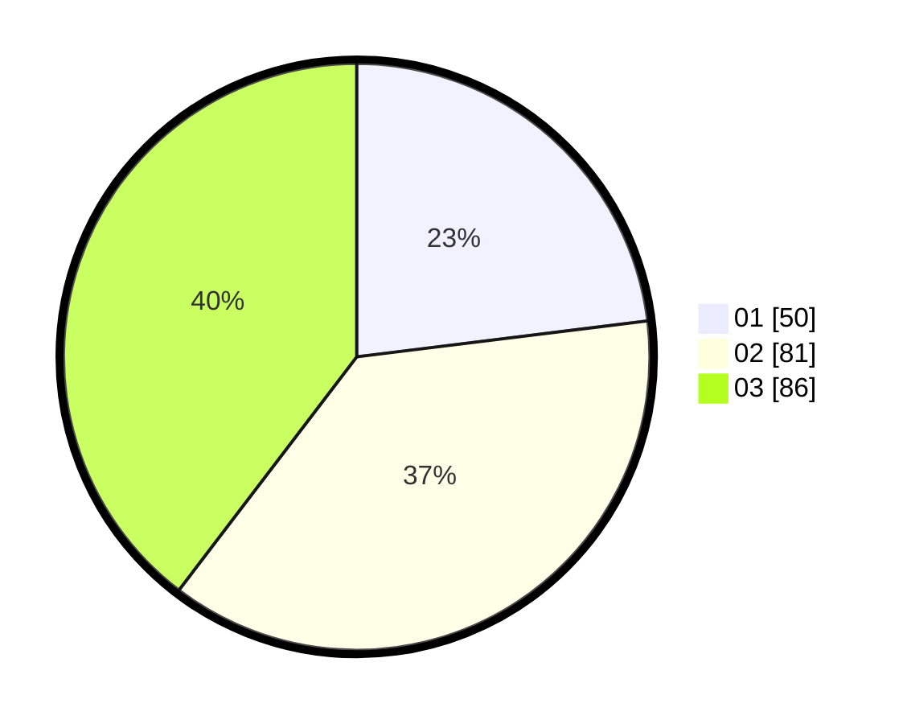

# Hasil

Hasil perolehan suara paslon dapat dilihat pada file paslon-01.txt, paslon-02.txt, dan paslon-03.txt.

Jika tidak ada, artinya data tersebut belum ada pada SIREKAP.

## Perolehan Suara

 * Paslon 01: **50**.
 * Paslon 02: **81**.
 * Paslon 03: **86**.

## Foto C Plano

https://sirekap-obj-formc.kpu.go.id/b8d4/pemilu/ppwp/31/74/10/10/02/3174101002081-20240214-201300--87415ed4-a652-48ee-b316-423b72c5c559.jpg

https://sirekap-obj-formc.kpu.go.id/b8d4/pemilu/ppwp/31/74/10/10/02/3174101002081-20240214-201351--6fa0c200-ae36-468e-aee8-fcbce3f8871d.jpg

https://sirekap-obj-formc.kpu.go.id/b8d4/pemilu/ppwp/31/74/10/10/02/3174101002081-20240214-201451--aa68982a-aac7-4238-b4cc-5fcaa6459718.jpg

## DATA PEMILIH TETAP

Jumlah pemilih dalam DPT: **266**.
 * L: **114**.
 * P: **152**.

## DATA PENGGUNA HAK PILIH

Jumlah pengguna hak pilih dalam DPT: **212**.
 * L: **87**.
 * P: **125**.

Jumlah pengguna hak pilih dalam DPTb: **2**.
 * L: **0**.
 * P: **2**.

Jumlah pengguna hak pilih dalam DPK: **12**.
 * L: **5**.
 * P: **7**.

Jumlah pengguna hak pilih: **226**.
 * L: **92**.
 * P: **134**.

## JUMLAH SUARA SAH DAN TIDAK SAH

JUMLAH SELURUH SUARA SAH: **217**.

JUMLAH SUARA TIDAK SAH: **7**.

JUMLAH SELURUH SUARA SAH DAN SUARA TIDAK SAH: **224**.
