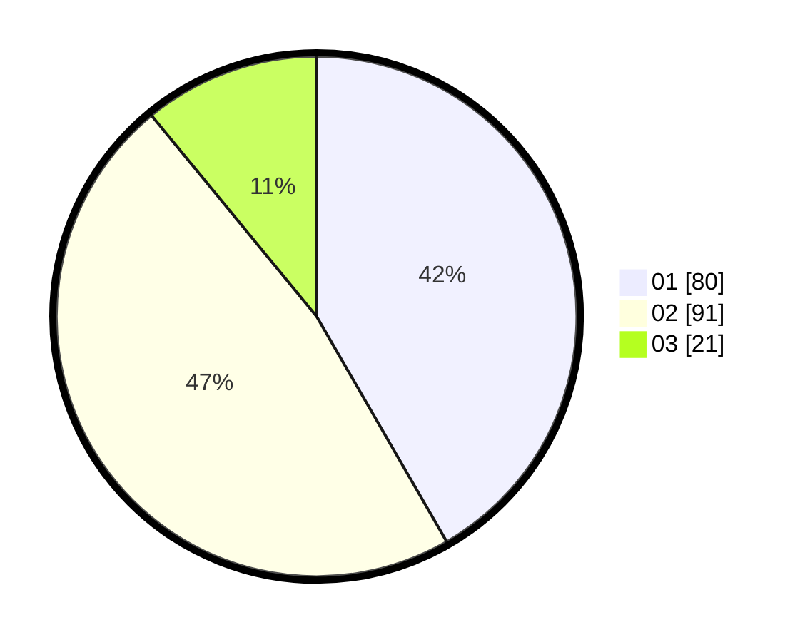

# Hasil

Hasil perolehan suara paslon dapat dilihat pada file paslon-01.txt, paslon-02.txt, dan paslon-03.txt.

Jika tidak ada, artinya data tersebut belum ada pada SIREKAP.

## Perolehan Suara

 * Paslon 01: **80**.
 * Paslon 02: **91**.
 * Paslon 03: **21**.

## Foto C Plano

https://sirekap-obj-formc.kpu.go.id/473a/pemilu/ppwp/31/74/10/10/02/3174101002092-20240214-193122--d8b0c9de-da05-4c02-8b72-581bae2ada06.jpg

https://sirekap-obj-formc.kpu.go.id/473a/pemilu/ppwp/31/74/10/10/02/3174101002092-20240214-193255--cdf694cd-0822-4fd9-9bd1-a41e11a1a472.jpg

https://sirekap-obj-formc.kpu.go.id/473a/pemilu/ppwp/31/74/10/10/02/3174101002092-20240214-193554--7d742a48-ef9b-4f5a-84d8-5ca0dcb90d0c.jpg

## DATA PEMILIH TETAP

Jumlah pemilih dalam DPT: **229**.
 * L: **111**.
 * P: **118**.

## DATA PENGGUNA HAK PILIH

Jumlah pengguna hak pilih dalam DPT: **193**.
 * L: **88**.
 * P: **105**.

Jumlah pengguna hak pilih dalam DPTb: **0**.
 * L: **0**.
 * P: **0**.

Jumlah pengguna hak pilih dalam DPK: **0**.
 * L: **0**.
 * P: **0**.

Jumlah pengguna hak pilih: **193**.
 * L: **88**.
 * P: **105**.

## JUMLAH SUARA SAH DAN TIDAK SAH

JUMLAH SELURUH SUARA SAH: **192**.

JUMLAH SUARA TIDAK SAH: **1**.

JUMLAH SELURUH SUARA SAH DAN SUARA TIDAK SAH: **193**.
