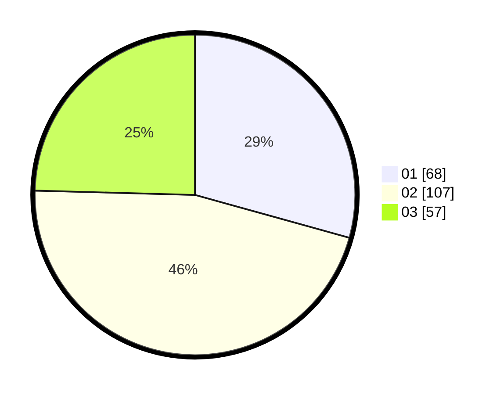

# Hasil

Hasil perolehan suara paslon dapat dilihat pada file paslon-01.txt, paslon-02.txt, dan paslon-03.txt.

Jika tidak ada, artinya data tersebut belum ada pada SIREKAP.

## Perolehan Suara

 * Paslon 01: **68**.
 * Paslon 02: **107**.
 * Paslon 03: **57**.

## Foto C Plano

https://sirekap-obj-formc.kpu.go.id/c178/pemilu/ppwp/31/74/10/10/02/3174101002099-20240214-155446--f6b8f951-99db-4699-b8ec-e05e692ac670.jpg

https://sirekap-obj-formc.kpu.go.id/c178/pemilu/ppwp/31/74/10/10/02/3174101002099-20240214-155531--1edbedd4-a551-4b6e-9ee6-0d39dd6d5201.jpg

https://sirekap-obj-formc.kpu.go.id/c178/pemilu/ppwp/31/74/10/10/02/3174101002099-20240214-155618--3ac746ff-8f41-4da8-8466-26ab4a31ae5b.jpg

## DATA PEMILIH TETAP

Jumlah pemilih dalam DPT: **286**.
 * L: **142**.
 * P: **144**.

## DATA PENGGUNA HAK PILIH

Jumlah pengguna hak pilih dalam DPT: **227**.
 * L: **116**.
 * P: **111**.

Jumlah pengguna hak pilih dalam DPTb: **6**.
 * L: **1**.
 * P: **5**.

Jumlah pengguna hak pilih dalam DPK: **4**.
 * L: **1**.
 * P: **3**.

Jumlah pengguna hak pilih: **237**.
 * L: **118**.
 * P: **119**.

## JUMLAH SUARA SAH DAN TIDAK SAH

JUMLAH SELURUH SUARA SAH: **232**.

JUMLAH SUARA TIDAK SAH: **5**.

JUMLAH SELURUH SUARA SAH DAN SUARA TIDAK SAH: **237**.
