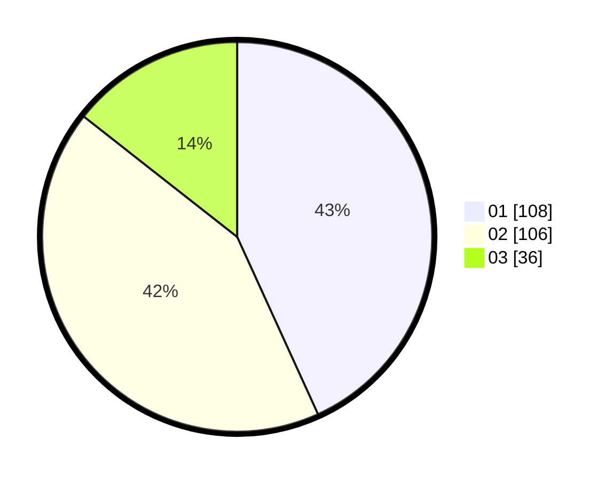

# Hasil

Hasil perolehan suara paslon dapat dilihat pada file paslon-01.txt, paslon-02.txt, dan paslon-03.txt.

Jika tidak ada, artinya data tersebut belum ada pada SIREKAP.

## Perolehan Suara

 * Paslon 01: **108**.
 * Paslon 02: **106**.
 * Paslon 03: **36**.

## Foto C Plano

https://sirekap-obj-formc.kpu.go.id/f3ee/pemilu/ppwp/31/74/10/10/02/3174101002102-20240216-143426--2f78a2fd-668e-496c-8814-fe256edf947d.jpg

https://sirekap-obj-formc.kpu.go.id/f3ee/pemilu/ppwp/31/74/10/10/02/3174101002102-20240216-143428--4df391f8-1185-4ae0-9b94-87b81091395b.jpg

https://sirekap-obj-formc.kpu.go.id/f3ee/pemilu/ppwp/31/74/10/10/02/3174101002102-20240216-143427--fd792914-6acc-43be-9b36-d0c26469e144.jpg

## DATA PEMILIH TETAP

Jumlah pemilih dalam DPT: **251**.
 * L: **115**.
 * P: **136**.

## DATA PENGGUNA HAK PILIH

Jumlah pengguna hak pilih dalam DPT: **298**.
 * L: **139**.
 * P: **159**.

Jumlah pengguna hak pilih dalam DPTb: **0**.
 * L: **0**.
 * P: **0**.

Jumlah pengguna hak pilih dalam DPK: **0**.
 * L: **0**.
 * P: **0**.

Jumlah pengguna hak pilih: **298**.
 * L: **139**.
 * P: **159**.

## JUMLAH SUARA SAH DAN TIDAK SAH

JUMLAH SELURUH SUARA SAH: **250**.

JUMLAH SUARA TIDAK SAH: **1**.

JUMLAH SELURUH SUARA SAH DAN SUARA TIDAK SAH: **251**.
